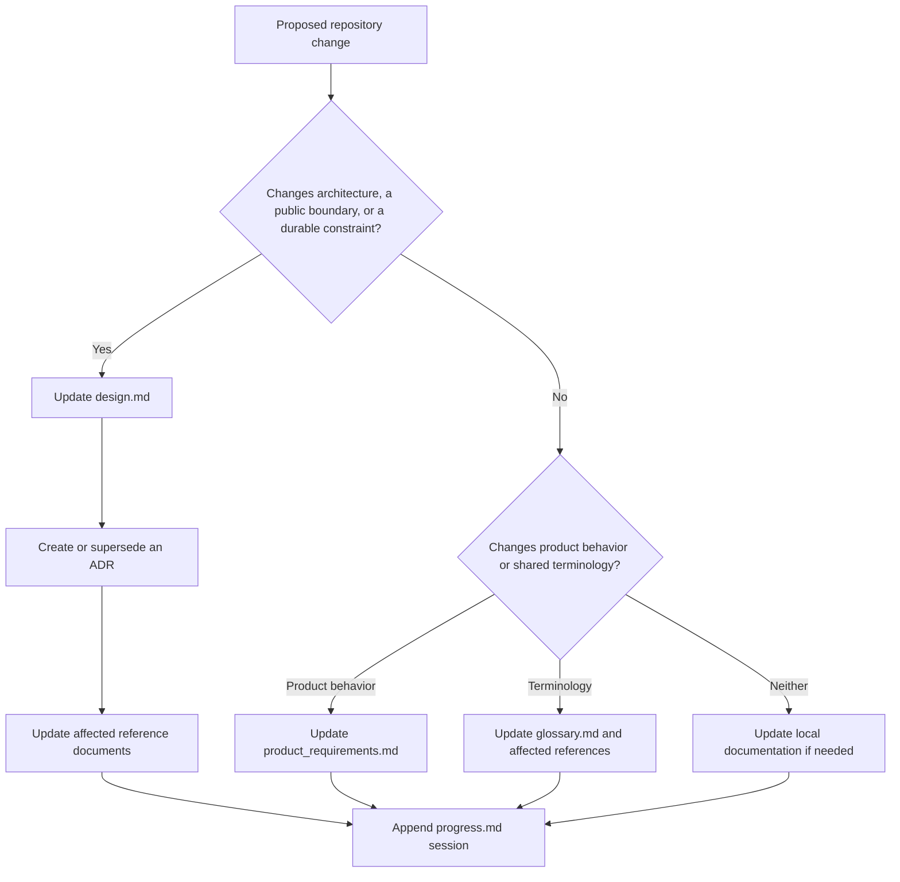
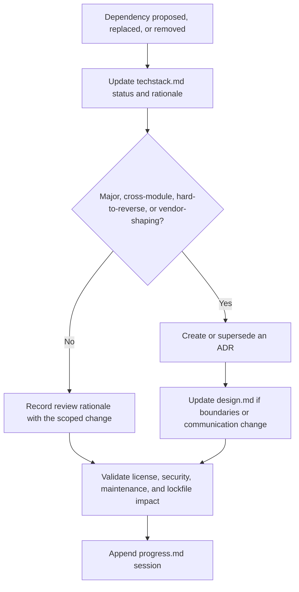
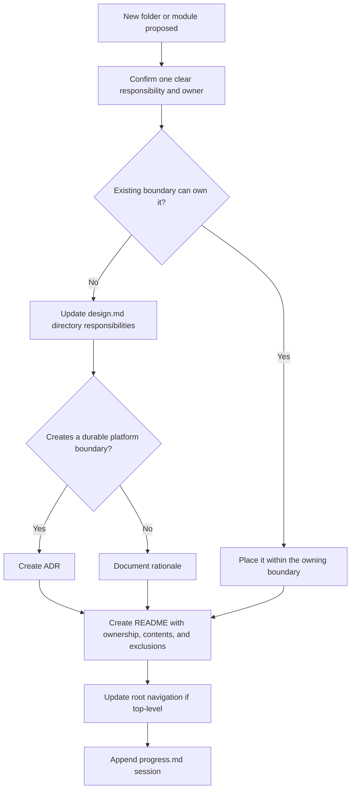
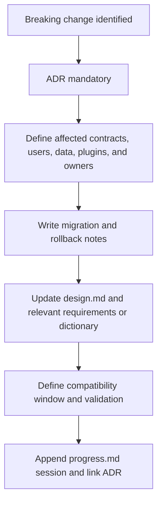
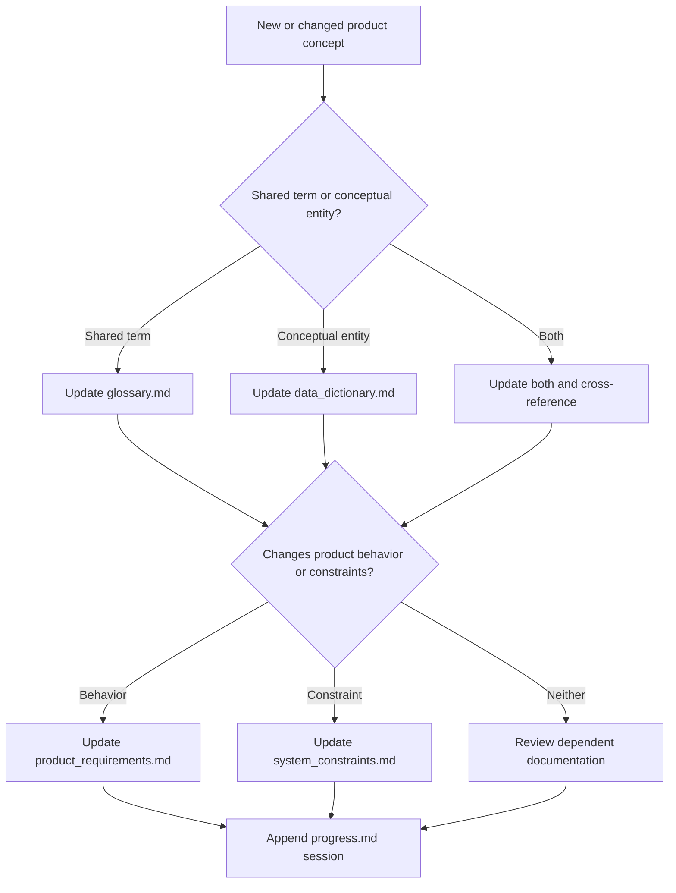
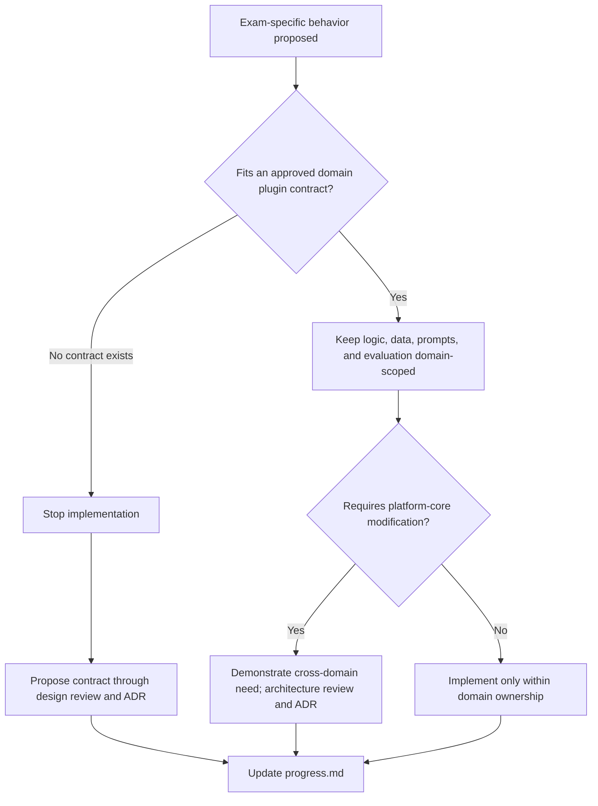

# Architecture Decision Flow

Use these flows to determine required documentation when a change has durable architectural impact. They complement the review checklists in [`coding_rules.md`](coding_rules.md); they do not replace maintainer judgment.

## Change Classification

An ADR is required for breaking changes, new platform boundaries, technology commitments, security or privacy posture changes, data-contract changes, domain-plugin contract changes, and intentional exceptions to dependency rules.

## Dependency Decision

No dependency may be added merely because it is familiar. Selection evidence belongs in `techstack.md`; durable tradeoffs belong in an ADR.

## New Folder or Module

Do not create empty organizational layers for hypothetical future code.

## Breaking Change

A breaking change includes incompatible behavior, data meaning, contract, plugin compatibility, security expectation, or removal of a supported workflow.

## Data and Terminology Changes

Avoid defining the same term differently in local READMEs. Link to the glossary or data dictionary.

## Domain-Specific Change

The product identity rule in [`coding_rules.md`](coding_rules.md) is permanent: exam-specific convenience is not sufficient reason to change the platform core.

## Decision Completion Checklist

- The current architecture and accepted ADRs do not conflict.
- Owners and affected users are identified.
- Alternatives, reversibility, migration, and rollback are explicit.
- Product requirements, constraints, terminology, and data meaning remain aligned.
- Security, privacy, accessibility, evaluation, and domain isolation were reviewed.
- `progress.md` records the outcome without removing prior sessions.

