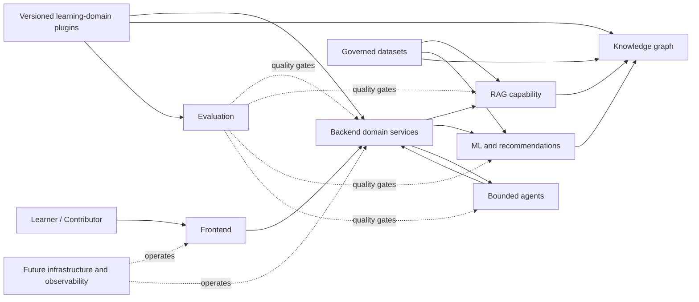

# Living Architecture

**Last Updated:** 2026-07-09  
**Architecture Version:** 0.4.0  
**Maintainers:** Yash Mishra ([yash-mishraa](https://github.com/yash-mishraa))
**Current Stage:** Stage 1 — Monorepo Foundation

## Vision

Build Kogniq, an open-source AI Learning Intelligence Platform that helps learners prepare deliberately across multiple competitive-examination domains while serving as a production-grade reference for modern AI engineering.

Kogniq is the platform. GATE is the first planned domain plugin and reference implementation. The architecture must allow future domains such as GRE, CAT, UPSC, JEE, and NEET without embedding any one examination's curriculum, terminology, or rules into the platform core.

## Goals

- Deliver accurate, explainable, curriculum-aware learning assistance.
- Personalize practice using measurable learner state and outcomes.
- Keep AI behavior observable, evaluable, reproducible, and safe.
- Maintain clear module ownership and replaceable technology boundaries.
- Preserve architectural context across long-running human and AI collaboration.
- Separate reusable learning intelligence from domain-specific curricula, assessments, taxonomies, and policies.

## Non Goals

- Building a generic conversational assistant.
- Selecting technologies before requirements and evaluation criteria exist.
- Coupling core learning workflows to one model, vendor, or database.
- Treating generated output as correct without grounding and evaluation.
- Implementing product or infrastructure during Stage 0.
- Implementing any GATE or other examination-domain plugin during repository planning.

## Core Principles

1. Learning outcomes precede feature volume.
2. Evidence and evaluation precede model sophistication.
3. Boundaries are explicit; implementations remain replaceable.
4. Data provenance, privacy, and consent are system requirements.
5. Deterministic workflows are preferred where agency is unnecessary.
6. Documentation and decisions evolve with the architecture.
7. Domain knowledge enters through explicit, versioned contracts; the platform core remains examination-neutral.

## Repository Philosophy

The repository is a modular monorepo. Top-level directories represent durable capability boundaries, not deployment units. Shared contracts should be explicit and minimal. Domain-specific packages must extend platform contracts rather than fork or contaminate the core. Experimental work must graduate through evaluation before entering product modules. AI context files are versioned operational memory, not incidental notes.

The Python workspace is rooted in `pyproject.toml` and managed with `uv`. Shared Python foundations target Python 3.12–3.13 and use centralized Ruff, MyPy, pytest, and coverage policy. Individual directories become installable workspace members only when their package boundary is approved.

## Repository Intelligence References

These documents refine this architecture without replacing it:

- [`glossary.md`](glossary.md) is the authoritative terminology reference.
- [`product_requirements.md`](product_requirements.md) defines intended product behavior without implementation choices.
- [`system_constraints.md`](system_constraints.md) records provisional operating assumptions and known unknowns.
- [`data_dictionary.md`](data_dictionary.md) defines conceptual product data objects without prescribing schemas.
- [`architecture_decision_flow.md`](architecture_decision_flow.md) directs documentation and ADR updates for common changes.
- [`prompts/README.md`](prompts/README.md) governs the manual prompt archive.
- [`system_blueprint.md`](system_blueprint.md) is the master engineering specification for planned system boundaries and flows.
- [`package_contracts.md`](package_contracts.md) defines future logical package ownership and dependency rules.
- [`service_catalog.md`](service_catalog.md) inventories planned logical service capabilities.
- [`pipeline_catalog.md`](pipeline_catalog.md) inventories planned processing and intelligence pipelines.
- [`api_catalog.md`](api_catalog.md) inventories possible external APIs without implementing or finalizing them.

When these references conflict with an accepted ADR, the ADR records the decision and this living architecture must be reconciled explicitly.

## High-Level Architecture

The future system will expose learning experiences through a frontend, coordinate learning workflows through backend services, and call independently testable intelligence capabilities. Versioned domain plugins will supply examination-specific curricula, taxonomies, content mappings, assessment conventions, and policies through governed contracts. Knowledge, learner, and evaluation signals will remain portable where valid and domain-scoped where required. Deployment topology will be decided after workload evidence exists.

## Planned Components

### API Application

`apps/api` owns the FastAPI application factory and foundational HTTP concerns. Its current public surface is limited to process health and version metadata; future application workflows, authorization enforcement, and package orchestration remain unimplemented.

### Web Application

`apps/web` will own accessible learner and contributor experiences, client state, and presentation—not domain truth or model logic.

### packages/content (`kogniq-content`)

- Pure-Python orchestration layer for the Content Intelligence Pipeline.
- **Bounded Context**: Transforms raw resources into sections, chunks, and normalized documents.
- **Key Concepts**: `LearningResource`, `ResourceSection`, `ResourceChunk`, `ContentProcessingPipeline`, `ProcessorRegistry`, `NormalizedDocument`.
- **Invariants**: Strictly immutable events and results, pure abstract interface definitions. O(1) lookups for plugin registry.

### packages/learning (`kogniq-learning`)

Own examination-neutral business language and bounded contexts for learning, assessment, student, documents, analytics, and recommendation.

### ML

Own learner modeling, knowledge tracing, ranking, recommendation, training, inference contracts, and model lifecycle artifacts.

### RAG

Own ingestion, indexing, retrieval, reranking, citation assembly, grounded-generation policies, and retrieval evaluation.

### Knowledge Graph

Own subject ontology, concepts, relationships, prerequisite structure, graph validation, and graph access contracts.

### Agents

Own bounded agent workflows, tool contracts, planning policies, memory policies, and safeguards. Agents must not bypass domain services.

### Evaluation

Own datasets, rubrics, harnesses, metrics, regression gates, and reporting for product, retrieval, model, safety, and learning quality.

### Experiments

Own temporary, reproducible investigations. Successful experiments require explicit graduation criteria before production adoption.

### Infrastructure

Future infrastructure will own build, runtime, deployment, observability, secrets integration, and environment configuration. Infrastructure must not contain product rules.

### Learning Domains

Future domain plugins will package examination-specific concepts, curriculum mappings, assessment rules, terminology, data adapters, and evaluation suites. GATE is the first planned reference implementation. A dedicated directory and plugin contract will be selected in a later architecture decision; no domain implementation exists during Stage 0.

## Directory Responsibilities

| Directory | Owns | Excludes |
| --- | --- | --- |
| `apps/api/` | Application composition and external contracts | Reusable domain or intelligence internals |
| `apps/web/` | Web experience | Server authority and AI pipelines |
| `packages/shared/` | Minimal stable cross-package contracts | Business and domain logic |
| `packages/domain/` | Examination-neutral bounded contexts | Delivery and provider concerns |
| `packages/ml/` | Predictive intelligence lifecycle | Product APIs |
| `packages/rag/` | Grounded retrieval lifecycle | General application workflows |
| `packages/agents/` | Agent orchestration contracts | Unbounded autonomous access |
| `packages/knowledge_graph/` | Ontology and graph lifecycle | Generic persistence |
| `packages/evaluation/` | Quality measurement and gates | Production serving logic |
| `infrastructure/` | Future operational definitions | Product and domain logic |
| `datasets/` | Governed dataset metadata | Untracked raw data |
| `experiments/` | Reproducible exploration | Production runtime code |
| `scripts/` | Narrow cross-repository utilities | Business logic |
| `docs/` | Audience-facing documentation | Architectural source of truth |
| `tests/` | Cross-boundary verification | Module-private tests when colocated |
| `.github/` | Collaboration automation | Runtime infrastructure |

## Future Architecture Diagram

This is a capability map, not a finalized deployment diagram.

## Naming Conventions

- Directories and Python modules: `snake_case`.
- TypeScript source files: convention to be selected before implementation.
- Types and classes: `PascalCase`; functions and variables: language-standard descriptive casing.
- Tests: mirror the subject name and clearly state behavior.
- Services: domain capability names, not vendor or protocol names.
- Domain plugins: stable lowercase identifiers independent of display names; the exact package convention is deferred.
- ADRs: `ADR-NNNN-short-title` within `decisions.md` until a separate ADR directory is justified.
- Environment variables: `UPPER_SNAKE_CASE`; secrets must never appear in source.

## Service Boundaries

Boundaries follow business capabilities and ownership. A module owns its invariants and exposes versioned contracts. Platform services must not contain examination-specific branching; domain behavior enters through approved plugin contracts. Direct access to another module's private storage is prohibited. A top-level directory does not automatically imply a network service; extraction requires independent scaling, reliability, security, or release evidence.

## Planned Pipelines

- Curated content: acquire → validate provenance → normalize → enrich → publish → evaluate.
- RAG: ingest → chunk → index → retrieve → rerank → generate with evidence → evaluate.
- ML: define task → version data → train → validate → register → deploy → monitor.
- Learner signals: capture consented events → validate → derive state → recommend → measure outcome.
- Knowledge graph: model ontology → ingest relations → validate → version → serve.
- Delivery: validate → test → evaluate → package → deploy → observe → rollback if needed.

## Dependency Rules

- Product modules may depend on shared contracts, never on another module's private implementation.
- Frontend communicates through supported backend contracts.
- Backend may orchestrate ML, RAG, graph, and agent capabilities through adapters.
- Agents use approved tools and domain interfaces; they do not directly mutate private stores.
- Evaluation may inspect all public outputs but must not become a runtime dependency.
- Experiments may depend on production contracts; production code must not depend on experiments.
- Datasets must be referenced through governed, versioned metadata.
- Domain plugins may depend on public platform contracts; the platform core must not depend on a specific domain plugin.
- Domain-specific datasets, ontology extensions, prompts, and evaluations must remain identifiable and versioned.
- Vendor SDKs must be isolated behind adapters where substitution or testing matters.
- Circular dependencies are prohibited.

## Module Communication Rules

Use typed, versioned contracts and propagate correlation identifiers. Synchronous calls suit immediate user workflows; asynchronous events suit durable background work. Contracts define timeouts, error semantics, idempotency, and ownership. Sensitive data is minimized at every boundary. Protocols and schemas will be selected in later ADRs.

## Scalability Goals

- Scale stateless request handling independently from expensive AI workloads.
- Support asynchronous ingestion, training, and evaluation.
- Partition by workload and data sensitivity when evidence requires it.
- Avoid premature microservices while preserving extractable boundaries.
- Define measurable capacity targets before production architecture is approved.

## Performance Goals

- Establish latency budgets by user journey before implementation.
- Stream long-running AI responses where it improves experience.
- Cache only with explicit freshness and invalidation rules.
- Measure retrieval, inference, and orchestration separately.
- Prefer graceful degradation when optional intelligence capabilities fail.

## Security Goals

- Apply least privilege, secure defaults, and defense in depth.
- Keep secrets out of source, logs, datasets, prompts, and generated artifacts.
- Protect learner data through consent, minimization, retention, and deletion policies.
- Defend AI boundaries against prompt injection, data exfiltration, unsafe tools, and poisoned content.
- Maintain auditability for privileged and model-mediated actions.
- Add threat modeling and dependency scanning before public deployment.

## Future Improvements

Future revisions should add bounded contexts, contract schemas, data classification, threat models, SLOs, deployment topology, model governance, disaster recovery, cost budgets, and detailed architecture diagrams as decisions become evidence-backed.
They should also define the domain plugin contract, compatibility policy, discovery mechanism, isolation model, and graduation criteria for domains beyond the GATE reference implementation.
