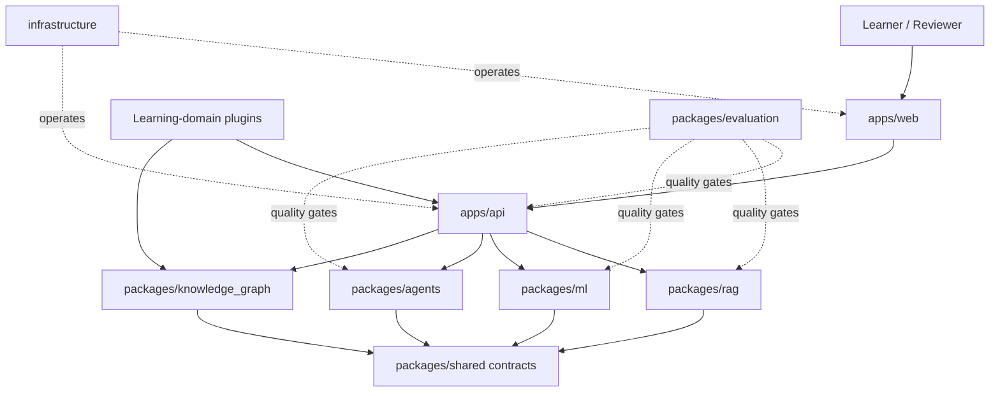
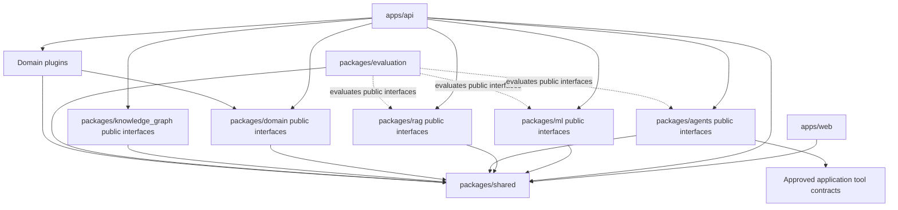
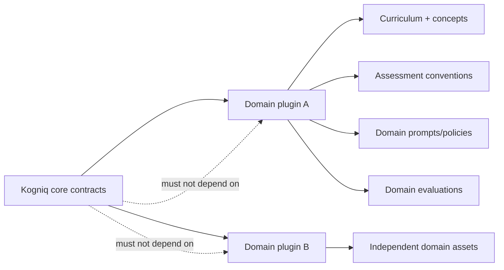
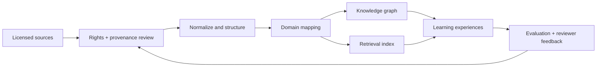
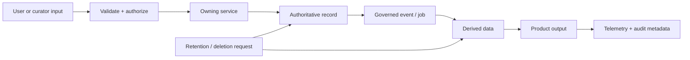
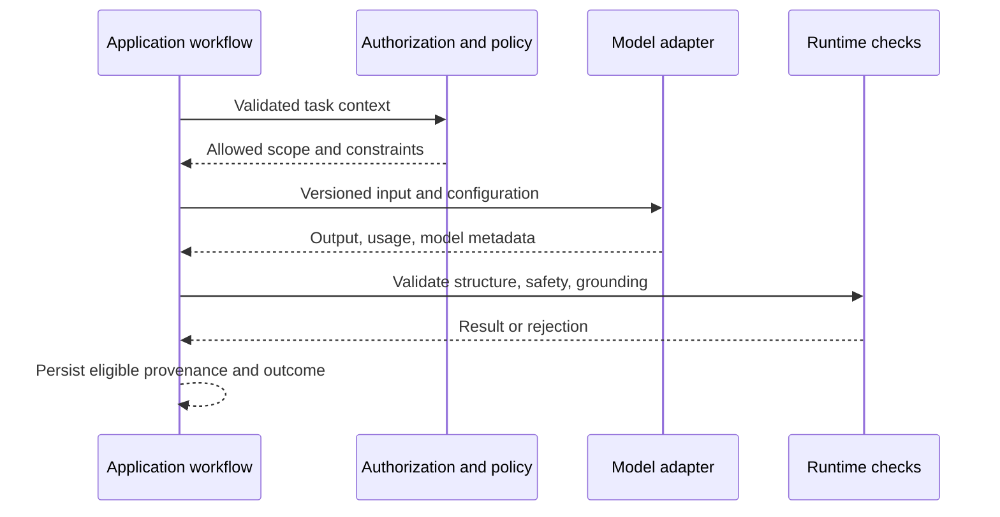
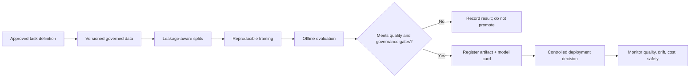
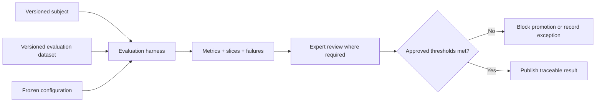
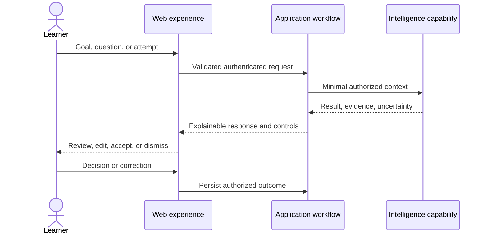

# Kogniq System Blueprint

**Status:** Planned engineering specification  
**Architecture Version:** 0.4.0  
**Last Updated:** 2026-07-09  
**Owner:** `<OWNER_NAME>`

This is the master engineering specification for Kogniq. It defines intended boundaries and flows without selecting technologies, creating deployable services, or authorizing implementation. Product behavior is governed by [`product_requirements.md`](product_requirements.md); terminology and conceptual data are governed by [`glossary.md`](glossary.md) and [`data_dictionary.md`](data_dictionary.md).

## Project Vision

Build a long-lived open-source reference for learning intelligence in which product behavior, AI quality, data governance, and operational discipline evolve together.

## Product Vision

Help learners decide what to study, understand difficult material through grounded explanations, practice deliberately, and revise from transparent evidence. Preserve learner agency: plans and inferences are inspectable, editable, and reversible.

## Platform Vision

Provide reusable, examination-neutral learning capabilities through stable contracts. Learning domains supply curricula, content mappings, assessment conventions, prompts, and evaluations as isolated plugins. GATE is the first planned reference domain, not the platform core.

## Repository Philosophy

- Use a modular monorepo until independent deployment has demonstrated value.
- Treat package boundaries as ownership and dependency boundaries, not automatic network services.
- Keep contracts stable, typed, versioned, and provider-neutral.
- Separate product runtime, offline pipelines, experiments, and evaluations.
- Preserve decisions and progress in version control.
- Promote experiments only after reproducible evaluation and ownership review.

The `apps/*`, `packages/*`, and `infrastructure` boundaries are now represented physically by documentation-only workspace directories. They remain planned runtime packages: no language project, dependency manifest, framework, service, or infrastructure resource exists.

## Core Architecture

Kogniq is organized into five planes:

1. **Experience plane:** learner and reviewer interaction through `apps/web`.
2. **Application plane:** authenticated domain workflows through `apps/api`.
3. **Intelligence plane:** ML, RAG, bounded agents, graph, and recommendations.
4. **Assurance plane:** evaluation, provenance, policy, and observability.
5. **Extension plane:** versioned learning-domain plugins behind platform contracts.

The application plane owns workflow authority. Intelligence components propose or derive results; they do not bypass authorization or mutate another package's private storage.

## High Level System Diagram

Arrows indicate permitted collaboration, not finalized protocols or deployment units.

## Package Responsibilities

Detailed contracts are in [`package_contracts.md`](package_contracts.md).

| Planned package | Primary responsibility |
| --- | --- |
| `apps/api` | Workflow authority and external application contracts |
| `apps/web` | Accessible user and reviewer experience |
| `packages/shared` | Stable cross-package contracts and primitives |
| `packages/domain` | Examination-neutral bounded contexts and business contracts |
| `packages/ml` | Learner modeling, ranking, training, and inference contracts |
| `packages/rag` | Ingestion, retrieval, grounding, generation, and citations |
| `packages/agents` | Bounded tool orchestration and agent policies |
| `packages/knowledge_graph` | Ontology, curriculum graph, validation, and graph queries |
| `packages/evaluation` | Metrics, datasets, harnesses, gates, and reports |
| `infrastructure` | Future build, runtime, deployment, and operational definitions |

## Service Responsibilities

Services are logical capabilities cataloged in [`service_catalog.md`](service_catalog.md). Initially, multiple services may run inside one application. Extraction requires evidence of independent scale, reliability, security, ownership, or release needs.

- Content services govern documents, chunks, and provenance.
- Intelligence services provide embeddings, retrieval, generation, graph access, and recommendations.
- Learning services govern questions, attempts, revision, and learner-facing workflows.
- Assurance services provide evaluation, analytics, configuration, and logging.
- Identity services enforce authentication and authorization when that roadmap stage is approved.

## Pipeline Responsibilities

Pipelines are observable sequences cataloged in [`pipeline_catalog.md`](pipeline_catalog.md). Each pipeline owns stage contracts, provenance, idempotency, retries, failure quarantine, and version lineage. Pipelines may invoke services but may not conceal durable business rules in orchestration glue.

## Database Responsibilities

No database technology is selected. Future persistence must follow ownership:

- A service owns its records, invariants, migrations, retention, and access policy.
- Other services use public contracts; direct access to private storage is forbidden.
- Transactional records, source artifacts, vector indexes, graph structures, event streams, caches, model artifacts, and analytical stores are distinct logical responsibilities.
- Derived data retains source and transformation versions.
- Deletion and retention propagate to eligible derived records.
- Storage selection follows measured access patterns, consistency needs, scale, privacy, and recovery objectives.

## Future AI Components

- Grounded explanation generation with claim-to-source traceability.
- Curriculum-aware question assistance and feedback.
- Recommendation and revision rationale generation.
- Safety classification, prompt-injection defense, and output policy checks.
- Human-review support for content and graph curation.

AI output remains advisory unless a deterministic, authorized workflow validates it.

## Future ML Components

- Knowledge-state estimation and knowledge tracing.
- Ranking of practice, content, and revision candidates.
- Difficulty and quality estimation with calibrated uncertainty.
- Embedding and reranking models.
- Drift, calibration, fairness, and outcome monitoring.

Every model requires a versioned task definition, baseline, data declaration, evaluation, limitations, and rollback path.

## Future RAG Components

- Rights-aware ingestion and parsing.
- Structure-preserving chunk derivation.
- Hybrid retrieval and domain filtering.
- Reranking and context assembly.
- Grounded generation and citation validation.
- Retrieval, attribution, and answer-quality evaluation.

## Future Agent Components

- Teacher Agent for bounded instructional strategies.
- Planner Agent for editable study and revision plans.
- Reviewer assistants for proposed content and graph changes.
- Approved tools with least privilege, typed inputs, bounded effects, timeouts, and audit records.

Agents never receive implicit access to stores or privileged operations.

## Future Evaluation Components

- Versioned evaluation datasets and slices.
- Deterministic regression harnesses.
- Expert review and adjudication workflows.
- Retrieval, grounding, model, agent, safety, accessibility, and learning-effectiveness metrics.
- Release gates with explicit owners and exception records.

## Infrastructure Overview

Future infrastructure will provide reproducible environments, build and artifact management, runtime isolation, secret delivery, workload scheduling, network policy, observability, backup, and recovery. Product behavior and domain rules remain outside infrastructure. No container, cloud, or orchestration choice is made here.

## Deployment Overview

The initial deployment shape should be the smallest topology that meets measured requirements. Likely logical workloads include:

- Web delivery.
- Application/API runtime.
- Background pipeline workers.
- Scheduled evaluation and training jobs.
- Governed persistence and artifact storage.

These are not committed deployable services. Environments must have promotion controls, configuration separation, migration safety, rollback, and traceable artifact versions.

## Security Overview

- Authenticate identities and authorize every protected action at an owned boundary.
- Treat uploads, retrieved text, plugin content, prompts, tools, and model output as untrusted.
- Enforce least privilege for services, agents, pipelines, people, and plugins.
- Separate tenant, learner, domain, and environment data where required.
- Encrypt sensitive data in transit and at rest using approved mechanisms.
- Minimize secrets and personal data in logs, traces, prompts, and evaluation artifacts.
- Threat-model uploads, RAG, agents, domain plugins, and supply chain before exposure.
- Preserve auditable provenance for privileged and model-mediated actions.

Security constraints are maintained in [`system_constraints.md`](system_constraints.md).

## Scalability Strategy

- Scale stateless interaction handling separately from expensive inference and pipelines.
- Queue durable background work with idempotent handlers.
- Partition by domain, tenant, workload, or sensitivity only when evidence requires it.
- Cache behind explicit freshness, authorization, and invalidation rules.
- Apply admission control and cost budgets to expensive AI work.
- Prefer vertical simplicity before distributed complexity.
- Load-test representative journeys and data distributions before topology changes.

## Observability Strategy

Use correlated telemetry across user interaction, workflow, pipeline, retrieval, inference, and external providers:

- Structured events and logs without sensitive payloads.
- Metrics for latency, throughput, saturation, errors, cost, and quality.
- Traces across boundary calls with model, prompt, dataset, and domain versions where safe.
- Product-quality dashboards paired with operational dashboards.
- Alerts tied to actionable objectives and owned runbooks.
- Audit records distinct from debugging telemetry.

## Configuration Strategy

- Separate code, non-secret configuration, secrets, domain content, and model artifacts.
- Validate configuration at startup and pipeline boundaries.
- Use explicit environment overlays without embedding environment behavior in source.
- Version behavior-shaping prompts, policies, model settings, feature decisions, and domain compatibility.
- Provide safe defaults; fail closed for missing security configuration.
- Record effective configuration for reproducibility without exposing secrets.

## Dependency Graph

Forbidden: circular package dependencies, production dependencies on experiments or evaluation implementations, frontend access to private stores, and platform-core dependencies on a specific domain plugin.

## Future Plugin Architecture

A plugin is a separately owned extension conforming to a versioned platform contract. A future plugin contract must define:

- Manifest identity, version, ownership, license, and compatibility.
- Capabilities and required permissions.
- Curriculum, ontology, prompt, content, and evaluation contributions.
- Data namespace and migration behavior.
- Installation, enablement, upgrade, disablement, and removal lifecycle.
- Isolation, resource limits, audit, and failure containment.
- Contract tests and conformance evidence.

Discovery, packaging, loading, and sandboxing remain undecided and require a separate ADR before implementation.

## Learning Domain Architecture

Cross-domain equivalence is an explicit governed mapping, never an assumption based on matching labels.

## Knowledge Flow

## Data Flow

Raw sensitive content must not flow into telemetry by default.

## Inference Flow

## Training Flow

## Evaluation Flow

## User Interaction Flow

## Development Principles

- Start from product behavior and evaluation criteria.
- Keep domain logic out of the platform core.
- Prefer explicit contracts and adapters over shared internals.
- Make deterministic behavior the default where agency is unnecessary.
- Design failures, retries, idempotency, migration, and rollback with the happy path.
- Treat privacy, security, accessibility, provenance, and observability as acceptance criteria.
- Select technology only after representative measurement.
- Keep documentation and implementation consistent in the same change.
- Use the root uv workspace and centralized Python quality configuration for future Python packages.

## Extension Strategy

Extend through public contracts, capability registration, adapters, and domain plugins. Additive compatible changes precede breaking changes. Each extension declares ownership, version, permissions, configuration, data impact, tests, documentation, and removal behavior.

## Technical Debt Strategy

Record debt in [`progress.md`](progress.md) with impact, owner, trigger, and intended resolution stage. Do not label unknown requirements as technical debt. Prohibit silent permanent workarounds in core boundaries. Debt affecting security, privacy, data integrity, or release correctness receives explicit priority and cannot be waived informally.

## Future Refactoring Strategy

- Refactor behind contract tests and measured behavior baselines.
- Separate packages or services only when ownership or operational evidence warrants it.
- Use compatibility layers and migration windows for public changes.
- Preserve data lineage and rollback across schema or model migrations.
- Remove deprecated paths only after consumers and plugins are verified.
- Record boundary or breaking refactors through the architecture decision flow.

## Repository Evolution Plan

1. **Stage 0–0.75:** Establish identity, context, product semantics, blueprint, and planned contracts.
2. **Stage 1:** Approve technology and infrastructure foundations from measured constraints.
3. **Stages 2–3:** Establish application and experience foundations against cataloged contracts.
4. **Stage 4:** Define data governance, knowledge architecture, and domain plugin contract; validate with the GATE reference domain.
5. **Stages 5–7:** Add evaluated RAG, ML, recommendation, and bounded agent capabilities.
6. **Stage 8:** Integrate, threat-model, load-test, evaluate, and harden.
7. **Stage 9:** Deploy through controlled, observable, reversible release.

Each transition requires explicit authorization, updated progress, and any required ADRs. Catalog entries are planning inventory; implementation status remains **Not Implemented** until verified otherwise.
