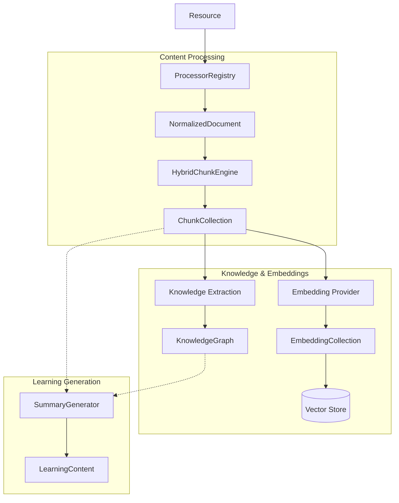

# Kogniq


## Project Vision

Kogniq is an open-source, agentic AI educational platform designed to transform raw learning materials—such as textbooks, documentation, and research papers—into interactive, personalized tutoring experiences. 

## Why Kogniq exists

Most AI tutors are merely wrappers around chat models. They lack a deep understanding of the *structure* of learning materials and the *pedagogy* required to teach them. Kogniq solves this by building a rigorous, Domain-Driven Design (DDD) foundation that processes content semantically, builds prerequisite knowledge graphs, and utilizes multi-agent systems to tutor students effectively.

## What Kogniq Is NOT

To understand our scope, it helps to understand what we are not building today:
- **Not an LMS**: We don't manage class rosters or gradebooks.
- **Not a note-taking application**: We aren't replacing Notion or Obsidian.
- **Not a generic chatbot**: We are strictly focused on pedagogical tutoring.
- **Not tied to any LLM vendor**: The architecture is provider-agnostic.
- **Not tied to any vector database**: The architecture is storage-agnostic.

## Current Repository Status

| Metric | Status |
|--------|--------|
| Workspace Packages | Multiple isolated domains (`shared`, `content`, `embedding`, etc.) |
| Developer Demos | 19 unique runnable demos demonstrating implemented components |
| Architecture Documents | Deep dives for every completed pipeline stage |
| Unit Tests | Hundreds of passing tests enforcing immutable invariants |
| Bounded Contexts | 8 distinct implemented contexts |
| Implemented AI Providers | SentenceTransformers, OpenRouter, Gemini |

## Current Capabilities

Kogniq currently provides a complete, end-to-end foundation for AI educational content generation.
- **Robust Content Pipeline**: Ingests Markdown, PDF, DOCX, HTML, and TXT files.
- **Deterministic Normalization**: Converts diverse formats into a unified `NormalizedDocument` structure.
- **Hybrid Chunk Engine**: Dynamically orchestrates structural and fixed-size strategies to generate AI-ready `ChunkCollection`s.
- **Local Embeddings**: Provider-agnostic generation of `EmbeddingCollection` using local transformers.
- **Vector Storage**: Provider-agnostic indexing using ChromaDB.
- **Knowledge Extraction**: Transforms raw chunks into a synthesized `KnowledgeGraph` using providers like OpenRouter and Gemini.
- **Learning Content Generation**: Produces AI-generated artifacts (like Summaries) directly from knowledge graphs.
- **100% Type Coverage**: Enforced by MyPy strict mode across all packages.

## Implemented Architecture

The following bounded contexts and concrete implementations are fully complete and tested in Kogniq today.

**Bounded Contexts**
- ✔ Shared
- ✔ Content
- ✔ Chunking
- ✔ Embedding
- ✔ Retrieval
- ✔ Knowledge
- ✔ Pipeline
- ✔ Learning Content

**Current Concrete Implementations**

*Processors*
- ✔ PDF
- ✔ DOCX
- ✔ Markdown
- ✔ TXT
- ✔ HTML

*Chunk Strategies*
- ✔ Structural
- ✔ Fixed Size
- ✔ Hybrid

*Embedding Providers*
- ✔ Local (SentenceTransformers)

*Vector Stores*
- ✔ ChromaDB

*Knowledge Extraction*
- ✔ Gemini
- ✔ OpenRouter

*Learning Generators*
- ✔ Summary Generator

## Current AI Pipeline



## Monorepo Structure

We use `uv` workspaces to manage multiple independent Python packages in a single repository.

### Workspace Packages
- `packages/shared/`: Core abstractions and domain primitives.
- `packages/content/`: File processing, normalization, and chunking.
- `packages/embedding/`: Provider-agnostic vector generation.
- `packages/retrieval/`: Semantic search and ranking.
- `packages/knowledge/`: Extraction of concepts and prerequisite graphs.
- `packages/pipeline/`: Orchestration of the intelligence pipeline.
- `packages/learning-content/`: Generation of educational artifacts (Summaries, Flashcards, etc.).

## Development Setup

1. Install `uv`:
   ```bash
   pip install uv
   ```
2. Sync the workspace:
   ```bash
   uv sync
   ```
3. Run the complete test suite:
   ```bash
   uv run python -m pytest
   ```

*See [docs/development.md](docs/development.md) for full instructions and developer demos.*

## Quality Gates

We enforce strict quality gates before any code is merged:
- All tests must pass (`uv run python -m pytest`).
- Code must be perfectly typed (`uv run python -m mypy .`).
- Code must be perfectly linted and formatted (`uv run ruff check .`).

## Current Implementation Status

| Component | Status |
|-----------|--------|
| Content Processing | ✅ Complete |
| Chunk Engine | ✅ Complete |
| Embedding | ✅ Complete |
| Vector Store | ✅ Complete |
| Retrieval | ✅ Complete |
| Knowledge Extraction | ✅ Complete |
| Learning Content | 🚧 In Progress |
| API | ⏳ Planned |
| Frontend | ⏳ Planned |

## Future Milestones

Please see [docs/ROADMAP.md](docs/ROADMAP.md) for a comprehensive view of upcoming features, including Notes, Flashcards, Quiz Generators, and the Frontend layer.

## Contributing

Contributions are welcome! Please read our [Development Guide](docs/development.md) to get started. Ensure all code passes the quality gates before submitting a pull request.

## License

MIT License. See `LICENSE` for details.
