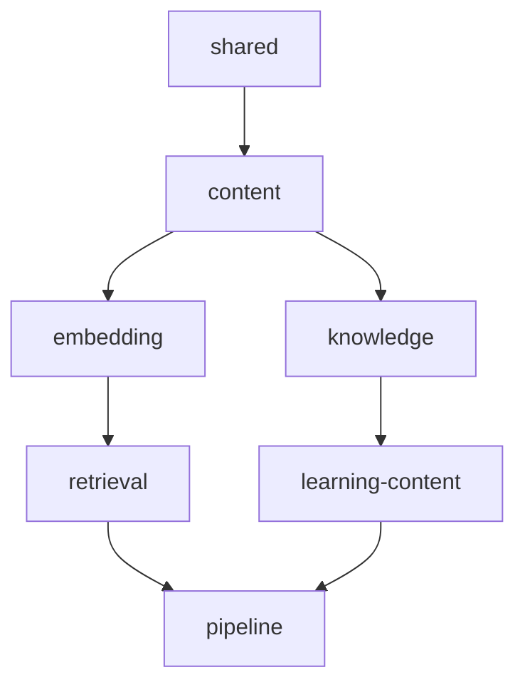
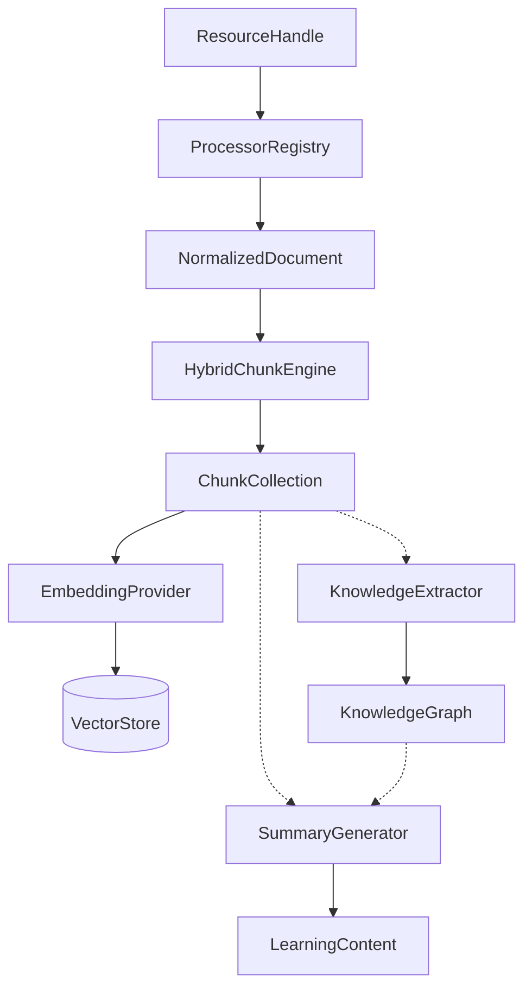

# System Architecture

Kogniq is designed as an agentic AI education system. Its architecture emphasizes robust data modeling, strict boundaries, and determinism.

## Architecture Principles

Our architecture is built on the following core principles:

- **Bounded Contexts**: The system is fractured into strict domain boundaries. Concepts in one domain do not leak into another.
- **Dependency Injection**: We use abstractions and inject concrete dependencies, ensuring testability and modularity.
- **Immutable Domain Models**: All domain models (e.g., `NormalizedDocument`, `ChunkCollection`, `KnowledgeGraph`) are deeply immutable. They are instantiated once and passed down the pipeline without side effects.
- **Provider-Agnostic Interfaces**: We never tightly couple to a specific AI vendor or database. Providers like OpenRouter, Gemini, or ChromaDB are abstracted behind interfaces.
- **Registry Pattern**: We dynamically route tasks using registries (e.g., `ProcessorRegistry`, `GeneratorRegistry`).
- **Composition over Inheritance**: We favor small, composable functions and classes over deep inheritance hierarchies.
- **Infrastructure Isolation**: Core domain logic has no dependencies on external frameworks, databases, or AI APIs. The domain is pure.

## Workspace Dependency Diagram

The Kogniq monorepo is structured into a hierarchy of dependent workspaces:

## Bounded Contexts

Kogniq currently implements the following bounded contexts:

### 1. Shared (`packages/shared`)
**Status: Implemented**
The foundational layer containing generic abstractions, interfaces, and utilities used universally across the codebase.

### 2. Content (`packages/content`)
**Status: Implemented**
Responsible for the physical structure of information. It ingests raw files, parses them using specialized `Processors`, and normalizes them into a canonical `NormalizedDocument`.

### 3. Chunking (Inside `content`)
**Status: Implemented**
Splits normalized documents deterministically via the `HybridChunkEngine` (combining `StructuralChunkStrategy` and `FixedSizeChunkStrategy`) into a `ChunkCollection`.

### 4. Embedding (`packages/embedding`)
**Status: Implemented**
Responsible for generating high-dimensional vectors from text using a provider-agnostic interface, producing an `EmbeddingCollection`.

### 5. Retrieval (`packages/retrieval`)
**Status: Implemented**
Handles indexing and searching embeddings using vector databases like ChromaDB.

### 6. Knowledge (`packages/knowledge`)
**Status: Implemented**
Synthesizes chunks into a structured `KnowledgeGraph` by extracting concepts and relationships using LLM providers.

### 7. Learning Content (`packages/learning-content`)
**Status: Implemented (Generators in progress)**
Generates educational artifacts like `LearningContent` (e.g., Summaries) utilizing the chunk collections and knowledge graphs.

### 8. Pipeline (`packages/pipeline`)
**Status: Implemented**
Orchestrates the end-to-end execution flow, moving data sequentially across all bounded contexts.

## Current End-to-End Pipeline

This is the canonical workflow currently implemented in Kogniq:

