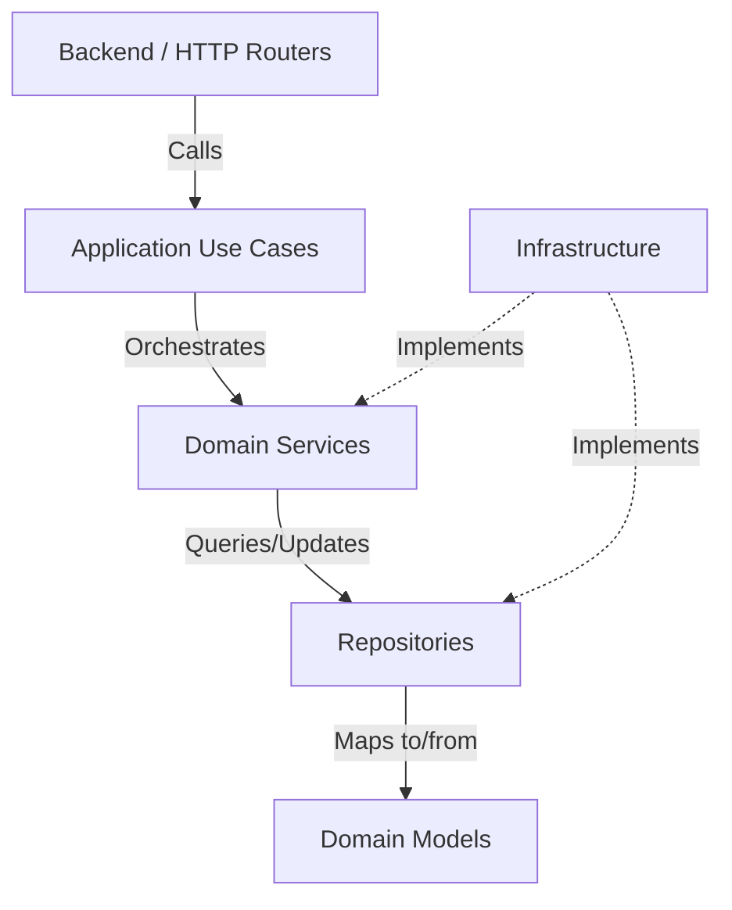

# Application Layer Architecture

Kogniq follows a strict layered architecture to decouple business orchestration from HTTP transport and infrastructure.

## Dependency Rule

The most critical rule of Kogniq's architecture is the strict dependency direction. **No layer may import upward.**

1. **Backend**: Thin HTTP transport adapter. Translates HTTP requests into Application DTOs.
2. **Application**: Owns the cross-domain orchestration logic (Use Cases). Validates authorization, fetches identities, and executes the sequence of domain service calls. Independent of FastAPI or any transport mechanics.
3. **Domain Services**: Encapsulate complex business rules and interact with repositories.
4. **Repositories**: Abstract data access and storage mechanisms.
5. **Domain Models**: Pure data structures representing the core business entities.

## Feature-Based Organization

The `application` package is organized by feature rather than by technical concern:

- `application/document/`
- `application/learning/`
- `application/retrieval/`
- `application/jobs/`

Each feature module contains its own `commands.py` (inputs), `responses.py` (outputs), and use case implementations. This ensures high cohesion and scalability as the application grows.

## Interfaces & Dependency Inversion

To maintain the strict dependency rule, the `Application` layer defines `Protocol` interfaces for any downstream services it needs to orchestrate (e.g., `DocumentServiceProtocol`, `AuthenticationServiceProtocol`). The `backend.dependencies` module acts as the Composition Root, injecting the concrete service implementations into the Use Cases at runtime.
