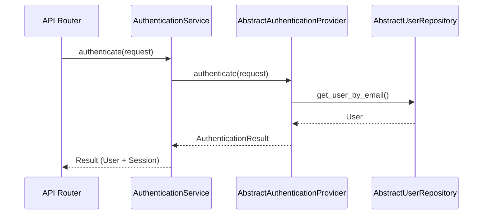
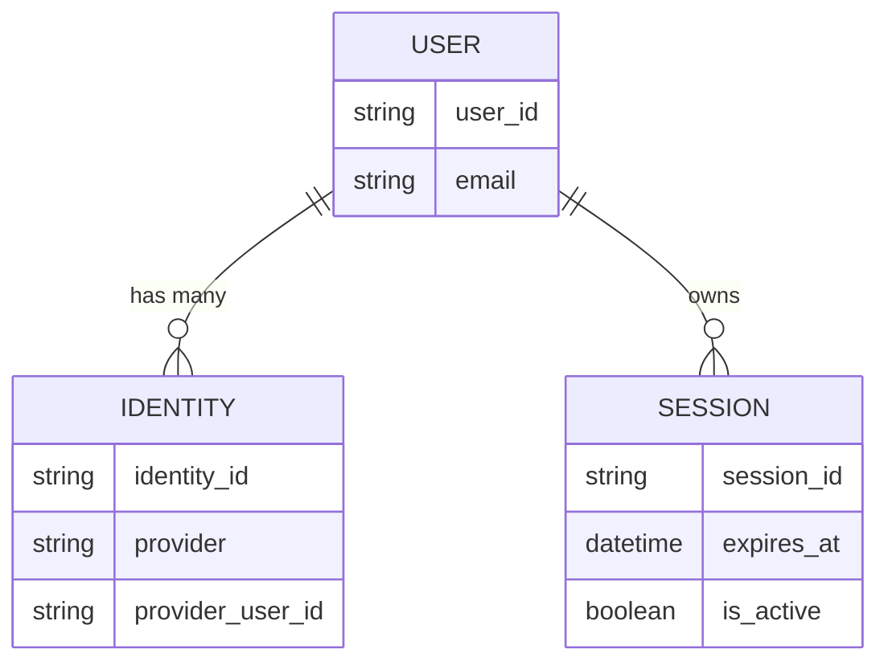

# Authentication Domain Architecture

Kogniq handles authentication by strictly separating identity resolution from domain logic, using an abstraction over authentication providers (like Better Auth). This design ensures that the application domain is never tightly coupled to specific authentication systems, HTTP logic, or JWT tokens.

## Architecture Pattern

## Bounded Context (`kogniq-auth`)

The `kogniq-auth` package contains:
- **Models**: Immutable structures (`User`, `Identity`, `Session`, `AuthenticationResult`).
- **Interfaces**: `AbstractAuthenticationProvider`, `AbstractUserRepository`.
- **Adapters**: `MemoryAuthenticationProvider`, `MemoryUserRepository` (for testing).

### Why Abstract Providers?
By routing authentication through `AbstractAuthenticationProvider`, we guarantee that if we switch from Better Auth to Clerk or Auth0, the `AuthenticationService` and backend routes never need to change. The implementation detail (how a session is generated, how cookies are parsed, how OAuth exchanges work) is encapsulated inside the concrete provider implementation.

## Models and Identities
A `User` represents a person in our system.
An `Identity` maps a third-party login (e.g. Google, GitHub) to a `User`. This supports users logging in via multiple providers seamlessly into the same `User` account.

