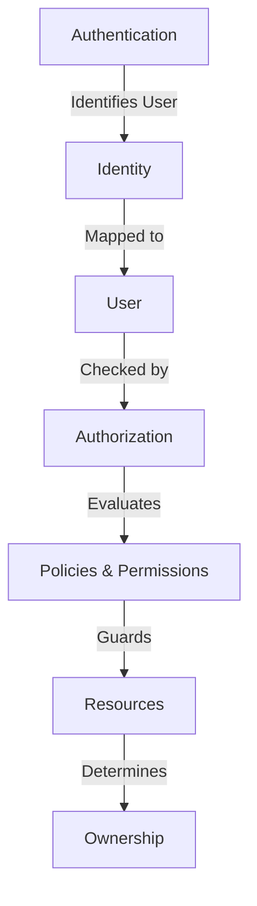
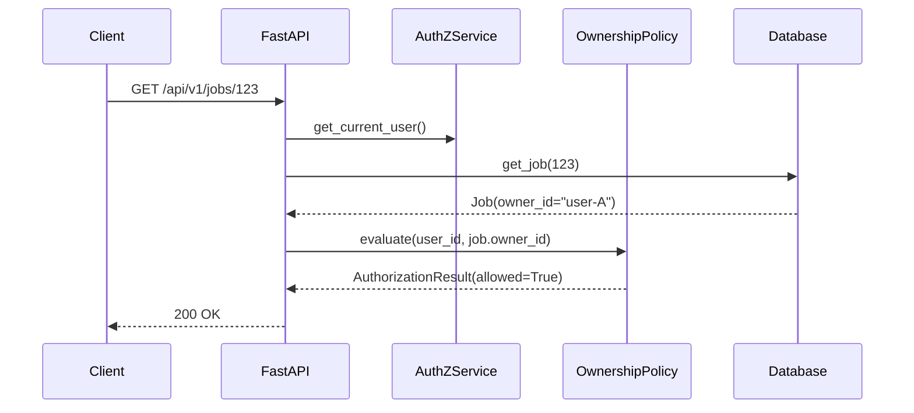

# Authorization Domain Architecture

This document describes how Kogniq determines *what* an authenticated user is allowed to access.

## Separation of Concerns

Kogniq strictly separates **Authentication** from **Authorization**.

1. **Authentication**: Resolves credentials into a `Session` and `User`.
2. **Identity**: Links an external provider (Local, Google) to the `User`.
3. **Authorization**: Looks at the `User` and checks if they hold the necessary `Role` or `Permission` to access a resource.
4. **Policies**: Reusable rule definitions (e.g., `OwnershipPolicy`) that dictate access contextually.
5. **Permissions**: Globally unique, atomic capabilities (e.g., `documents:read`).
6. **Ownership**: The relationship between a user and a resource (e.g., a Document belongs to `user-123`).
7. **Resources**: The actual domain entities (Documents, Jobs, Study Guides).

## Core Concepts

- **Permission**: An immutable definition of an action. Permissions are never duplicated.
- **Role**: A collection of permission IDs. Roles can be assigned to users.
- **UserRole**: A record mapping a `User` to a `Role`.
- **AuthorizationResult**: An immutable audit object returning whether an action was `allowed`, the `reason`, and the `evaluated_permission`.

## Policies & Ownership

We use generic policies to avoid duplicating logic across resources.

This decoupled architecture allows Kogniq to smoothly transition to JWTs or Better Auth in the frontend without ever modifying backend permission rules.
