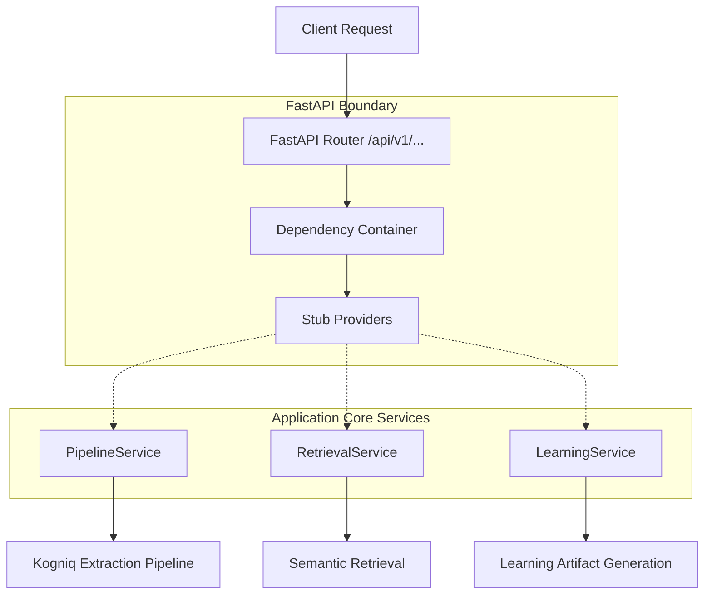

# FastAPI Backend Foundation

The backend of Kogniq acts as the singular entry point for all AI capabilities, search requests, and knowledge extraction. It establishes a resilient, production-ready FastAPI foundation using Dependency Injection and rigorous separation of concerns.

## Architecture & Request Lifecycle

## Core Principles

1. **API Versioning**: All internal service endpoints are nested cleanly under `/api/v1` ensuring backward compatibility as we scale.
2. **Global Exception Handling**: Any `BackendError` raised deep in the application stack is automatically intercepted and serialized into a consistent `{ "error": { "code": ..., "message": ... } }` schema.
3. **Dependency Injection**: We enforce the Dependency Inversion Principle. The FastAPI routers receive generic structural `Protocol` instances (like `LearningService`) via `Depends()`. The actual instantiation (and testing overrides) happen inside the dependency container.
4. **Environment-Driven Configuration**: Settings are loaded entirely through Pydantic `BaseSettings`, allowing dockerized deployments without code modifications.
