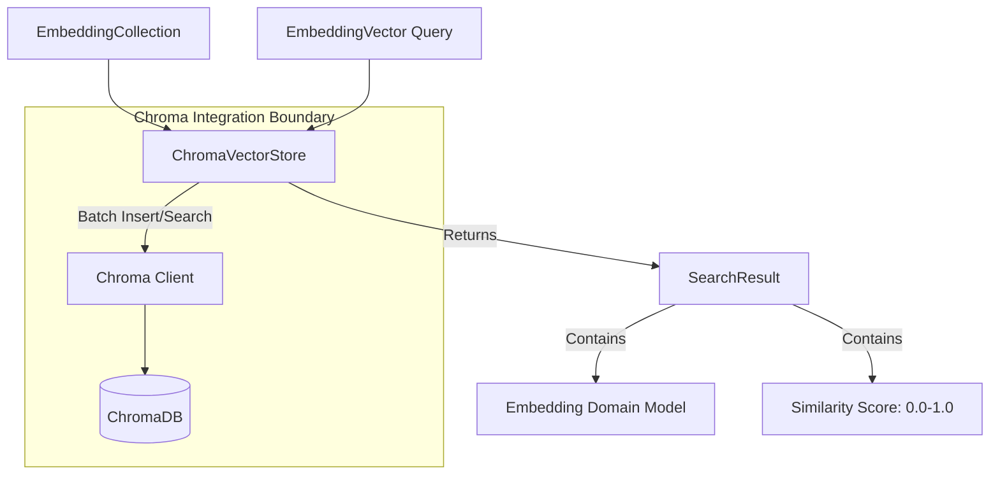

# ChromaDB Vector Store Foundation

**Last Updated:** 2026-07-13
**Status:** Implemented

## Context

Kogniq required a concrete implementation of the `AbstractVectorStore` contract to demonstrate full end-to-end viability for our embedding domain. We selected ChromaDB as our first concrete provider.

## Why ChromaDB?

1. **Local-first capability:** Chroma supports an in-memory (`EphemeralClient`) and local persistent (`PersistentClient`) mode, making it trivial to test and develop without standing up external databases.
2. **Batch API Support:** Chroma provides efficient bulk insertion and deletion endpoints, mapping well to our `EmbeddingCollection` domain model.
3. **Provider-Agnostic Engine:** Unlike some solutions tightly coupled to a single vendor's embeddings, Chroma operates easily over raw vectors.

## Persistent vs Ephemeral Modes

- **Ephemeral Mode:** Instantiated by default or when `persist_directory` is `None`. Ideal for testing, continuous integration, and rapid demonstrations without leaving artifacts.
- **Persistent Mode:** Instantiated when a `persist_directory` is explicitly passed. Automatically saves SQLite metadata and HNSW index graphs to disk.

## Metadata Strategy

`ChromaVectorStore` explicitly flattens the rich `EmbeddingMetadata` domain object into a 1-dimensional dictionary suitable for Chroma's storage engine. 

Fields stored:
- `chunk_id`
- `provider`
- `model_name`
- `embedding_version`
- `dimensions`
- `normalized`
- `language`
- `document_id`

## SearchResult Mapping

Chroma returns the underlying distance between two vectors based on the space it was configured for. `ChromaVectorStore` is strictly configured for `"cosine"`.

For `"cosine"`, Chroma returns the cosine distance, which is `1 - cosine_similarity`. The vector store implementation securely normalizes this output back into a `0.0` to `1.0` scale (clamping precision errors) to construct the standard `SearchResult` object.

## Architecture

