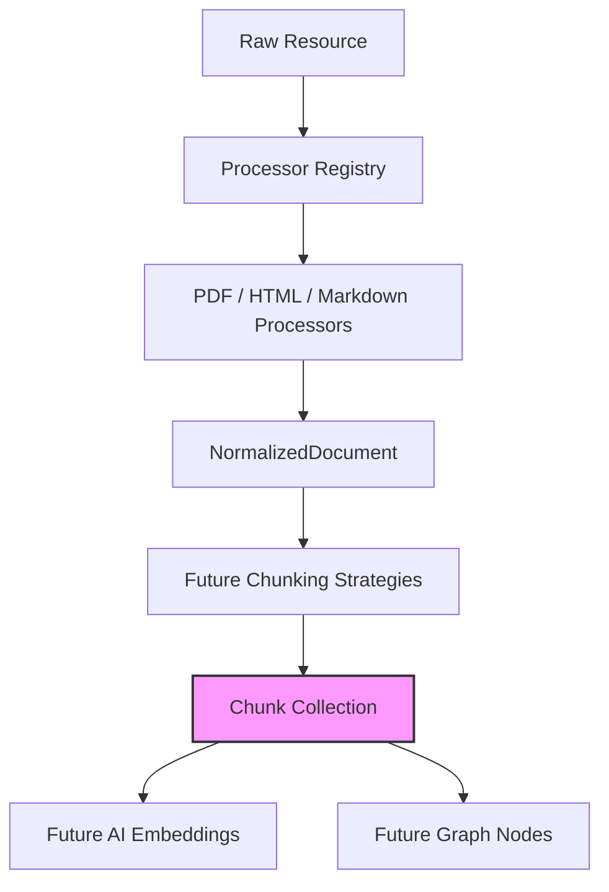

# Universal Chunk Engine

## Overview
The Universal Chunk Engine is the foundational domain model bridging the gap between parsed `NormalizedDocument` entities and Kogniq's future AI capabilities (such as embedding, retrieval, and knowledge graphs).

This engine deliberately contains no splitting logic or AI integration. It strictly establishes the canonical, processor-independent data structure that all future AI features will consume.

## Architecture

## Immutability & Agnosticism
`Chunk`, `ChunkMetadata`, and `ChunkStatistics` are implemented as frozen Python dataclasses. Immutability guarantees that once a chunk is emitted by a strategy, its boundaries, text, and source attribution cannot be corrupted by downstream vectorizers or retrievers.

The model explicitly avoids coupling to infrastructure:
- It relies on simple estimations for tokens and characters, avoiding heavy dependencies like `tiktoken` or HuggingFace tokenizers.
- It contains placeholder properties (`future_embedding_id`, `future_graph_node_id`) to ensure future integrations are accommodated natively without violating the core dependency rule.
