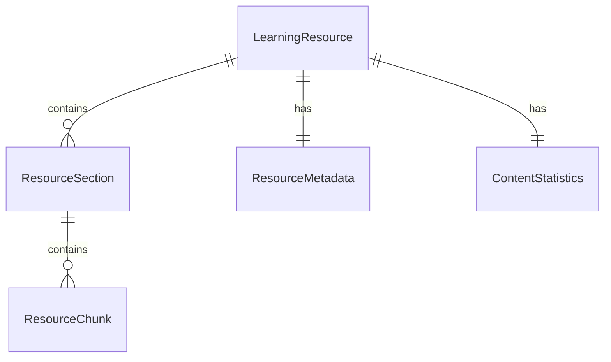
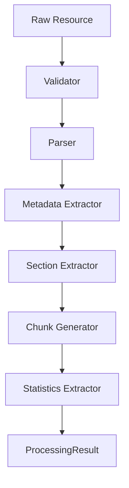
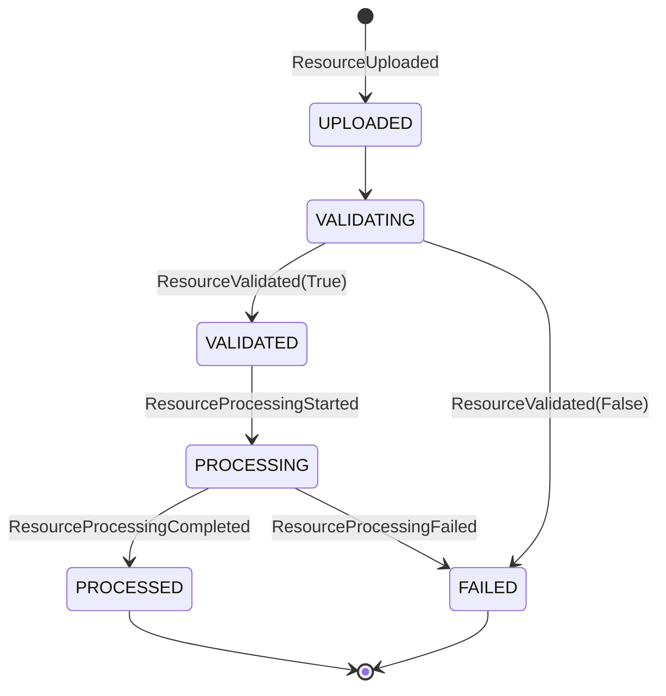
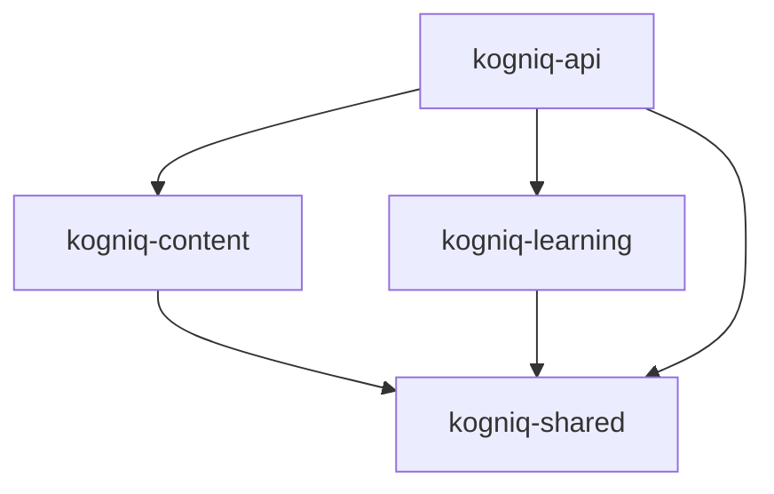

# Content Intelligence Foundation

## Purpose
The Content domain manages the lifecycle of raw learning resources (e.g., PDFs, Markdown, Videos) as they are validated, parsed, and semantically chunked into usable representations for AI processing. It operates as a pure Python orchestration layer, completely decoupled from specific AI models, OCR tools, or persistence layers.

## Entity Relationships

## Processing Pipeline Flow

## Domain Event Flow

## Package Dependencies

