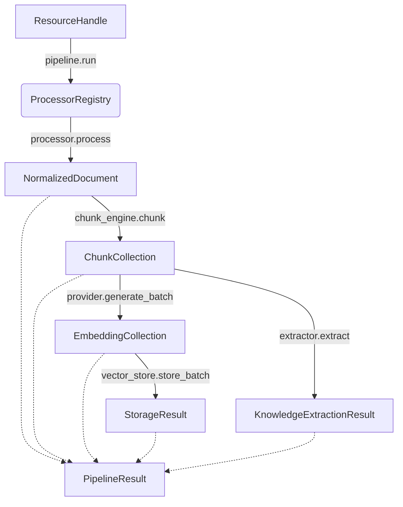

# Document Intelligence Pipeline

The `DocumentIntelligencePipeline` is the central orchestration service in Kogniq. It coordinates the execution of isolated bounded contexts (`kogniq-content`, `kogniq-embedding`, and `kogniq-knowledge`) without introducing coupling between them or referencing any provider-specific implementations.

## Core Design Principles

1. **Dependency Injection**: The pipeline receives its dependencies (the bounded contexts' interfaces) exclusively via its constructor. It has zero knowledge of concrete implementations (e.g., ChromaDB, Gemini, Llama).
2. **Strict Flow**: Execution is strictly sequential, moving from normalization to chunking, embeddings, storage, and knowledge extraction.
3. **Immutability**: The pipeline produces a strictly immutable `PipelineResult` which acts as the canonical record of processing.
4. **Separation of Concerns**: The pipeline is *only* orchestration. It contains no file parsing logic, chunking algorithms, AI prompts, or HTTP communication.

## Architectural Flow



## Structure of `PipelineResult`

To future-proof the pipeline against an expanding feature set (Retrieval, Learning, Quizzes, etc.), the output is grouped logically:

```text
PipelineResult
├── content
│      document: NormalizedDocument
│      chunks: ChunkCollection
├── embeddings
│      collection: EmbeddingCollection
│      storage_result: StorageResult
├── knowledge
│      extraction_result: KnowledgeExtractionResult
└── metadata: PipelineExecutionMetadata
```

## Storage Result Retention

A critical design feature is the retention of the `StorageResult` object returned by the vector store. Instead of discarding the outcome of storage operations, `StorageResult` holds data such as:
- `stored_count`
- `collection_name`
- `metadata`

This guarantees that future features requiring vector synchronization, deletion, indexing, or retrieval will have immediate access to the necessary references without refactoring the core pipeline.
