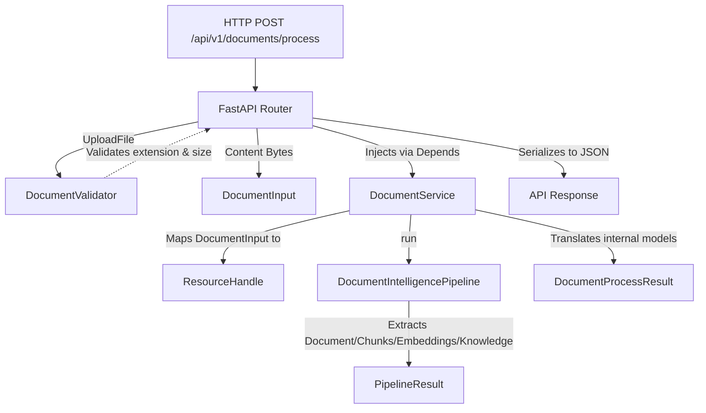

# Document Processing API

Kogniq's Document Processing API exposes the internal `DocumentIntelligencePipeline` to the outside world through a rigorous orchestration layer, strictly enforcing the Dependency Inversion Principle.

## Request Flow

## Architectural Highlights

- **Zero AI Logic in the Backend**: The API only performs validation, HTTP to internal model mapping, and exception translation.
- **`DocumentInput` Abstraction**: Bridges the gap between HTTP-specific models (`UploadFile`) and the backend processing logic, meaning the backend does not care if the file came from S3, an API endpoint, or disk.
- **Factory-Driven Pipeline Injection**: The API constructs the pipeline via `PipelineFactory`, seamlessly allowing integration tests to fake the pipeline while production uses fully loaded vector stores and models.
- **Safe Response Model**: Kogniq prevents exposing raw embeddings or full textual contexts through the `DocumentProcessResponse`, returning metadata about the completed extraction (such as node counts, chunks extracted, etc.).
