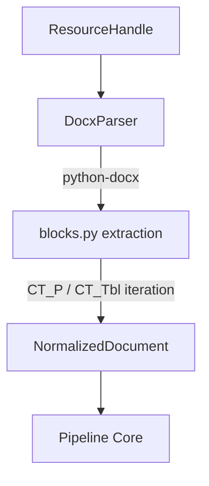

# DOCX Processor Architecture

The DOCX processor (`packages/content/src/content/processors/docx`) is responsible for linearly extracting semantic content from Microsoft Word (`.docx`) documents and normalizing them into `NormalizedDocument` representations.

It is the third concrete implementation of the `AbstractContentProcessor` adhering to the standard content pipeline boundary.

## Pipeline Architecture



## Supported Syntax

The processor natively parses and normalizes the following DOCX structures by traversing the root `<w:body>` element linearly:
- **Headings**: Mapped to `BlockType.HEADING` based on paragraph styles (`Heading 1`, `Title`, etc.).
- **Paragraphs**: Standard text paragraphs mapped to `BlockType.PARAGRAPH`.
- **Lists**: Mapped to `BlockType.LIST` based on paragraph style (`List Bullet`, `List Number`, etc.).
- **Tables**: Recognized table syntax mapped to `BlockType.TABLE`.

## Limitations

- **Images**: Embedded images are ignored in this implementation. Future support may map images to Image blocks.
- **Equations**: OXML Math (`<m:oMath>`) is ignored. Future stages could translate to LaTeX.
- **Page Breaks**: DOCX files use logical layout flow. While explicit page breaks (`<w:br w:type="page">`) or `<w:lastRenderedPageBreak>` exist in the markup, they do not perfectly represent the document's paginated appearance across all Word viewers. For simplicity and correctness within `python-docx` limitations, this parser treats the entire document as one contiguous `NormalizedPage`.

## Future Support

In future milestones, we will add support for:
- Image extraction and embedding mapping.
- Equation (`m:oMath`) conversion to math format.

## Developer Verification

A standalone developer utility `dev/demo_docx_processor.py` is available for verifying the processor against local DOCX files. It will dynamically generate a sample file if none is provided.

Usage:
```bash
uv run python dev/demo_docx_processor.py [path_to_docx]
```
By default, it looks for `dev/sample_documents/sample.docx`.
