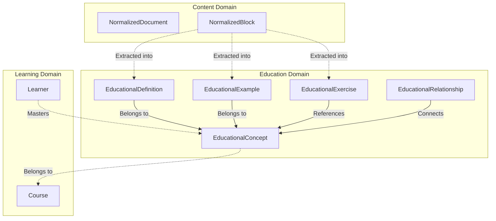

# Educational Knowledge Layer Architecture

## Purpose
The `education` bounded context is the semantic bridge between the raw parsed structure of a document (e.g., Normalized Document Model) and the actual pedagogical concepts meant to be taught.

It models the purely educational semantics—definitions, examples, exercises, and conceptual relationships—independent of any specific extraction algorithm (like a LLM or heuristic parser) or storage mechanism (like a graph database).

## Architecture

## Core Principles
1. **Extraction Agnostic:** This layer defines what an educational concept *is*, not *how* an AI finds it in a PDF.
2. **Persistence Agnostic:** This layer defines relationship edges (e.g., Prerequisite), not graph database query structures.
3. **Immutability:** Educational entities and value objects are immutable once constructed to ensure predictable behavior during the eventual knowledge graph ingestion process.
