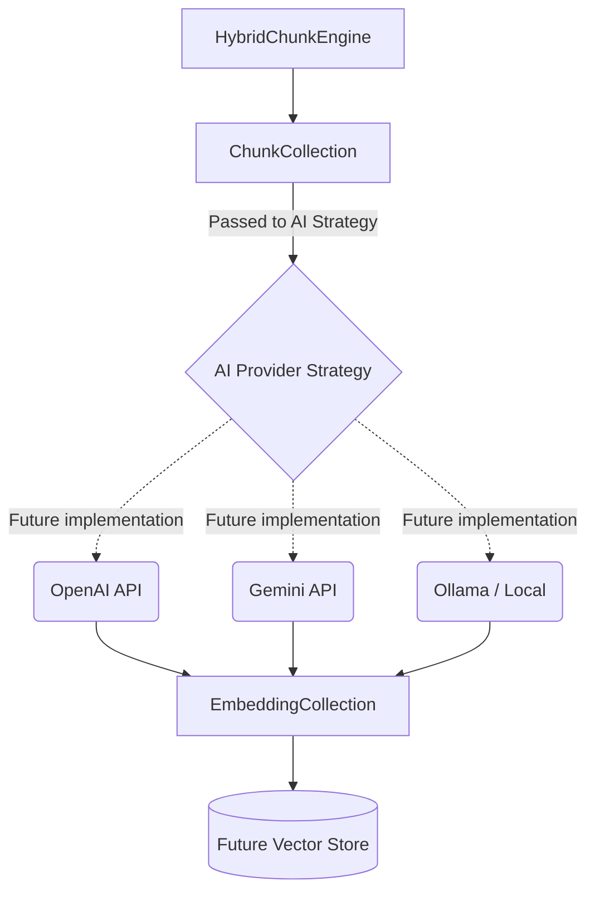

# Universal Embedding Domain

## Overview
The `embedding` package defines Kogniq's canonical, provider-independent domain for embedding vectors.

## Why Provider-Independent?
There are numerous AI models capable of generating embeddings (OpenAI, Gemini, Ollama, Sentence Transformers). Rather than coupling the core pipeline to a specific vendor's SDK, Kogniq abstracts the concept of a high-dimensional vector into a pure data structure (`EmbeddingVector`). 

This guarantees that vectors generated by local huggingface models and remote API models can be managed, validated, and stored via the exact same interfaces downstream.

## Why Immutable?
Embeddings represent a mathematical snapshot of a specific text string via a specific model version at a specific point in time. Modifying an embedding vector post-generation mathematically invalidates it. Strict immutability guarantees data integrity through the system pipeline.

## Embedding Versioning
`EmbeddingMetadata` includes an `embedding_version` (e.g. `v1`). This explicitly isolates generation runs where the underlying AI model (e.g. `text-embedding-3-small`) remained identical, but preprocessing steps (like text normalization or prompt prefixing) were altered, yielding completely different mathematical outputs for the same chunks.

## Relationship to ChunkCollection
The chunking process (`HybridChunkEngine`) yields a `ChunkCollection`. The future AI layer will ingest this collection, query the appropriate provider API, and yield an `EmbeddingCollection` mapped back to the origin chunks via `chunk_id`.

*Note: Storage, indexing, and retrieval are strictly decoupled from this domain and will be handled by subsequent architecture layers.*
