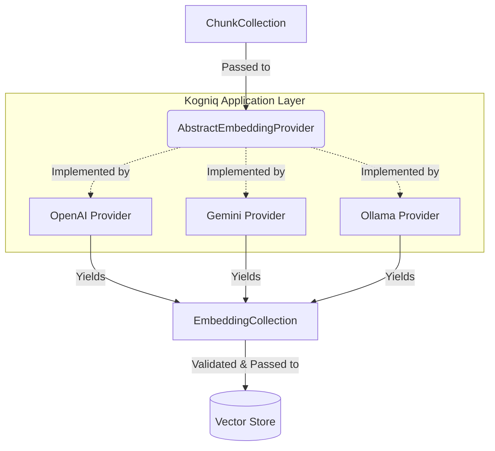

# Universal Embedding Provider Architecture

## Overview
The `AbstractEmbeddingProvider` interface defines the exact abstraction layer separating Kogniq's pure mathematical domains from third-party AI execution layers (like OpenAI, Gemini, or local models).

## Why Abstract Providers?
By strictly coupling Kogniq's generation orchestrators to an `AbstractEmbeddingProvider` rather than concrete SDKs (like `openai`), we guarantee:
1. **Vendor Agnosticism**: We can switch from OpenAI to Gemini, or fallback to local HuggingFace models, without changing a single line of business logic in the orchestrators.
2. **Predictable Invariants**: Every provider yields the identical, highly-validated `EmbeddingCollection` structure, ensuring downstream retrieval behaves deterministically.
3. **Purity of Core**: The `embedding` domain remains lightweight, loading instantly without dragging heavy dependencies like `torch` into memory until a concrete provider is actively selected.

## Provider Registry
The `EmbeddingProviderRegistry` maintains an O(1) catalog of all initialized providers, operating primarily on `provider_id` (a stable machine identifier) to prevent breaking changes when display names are adjusted.

## Data Flow Pipeline

*Note: The actual implementation of `OpenAI Provider`, `Gemini Provider`, etc. lives outside the core domain in application services.*
