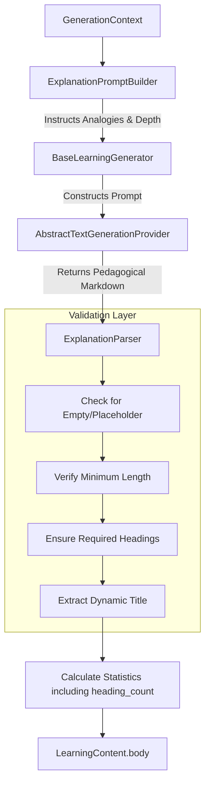

# Explanation Generator Architecture

The `ExplanationGenerator` is the fifth concrete learning generator for Kogniq, extending the markdown generation pattern but with a distinct pedagogical objective: teaching rather than summarizing.

## Architecture

## Features

1. **Pedagogical Focus**: Unlike `SummaryGenerator` which compresses information, `ExplanationGenerator` uses intuitive analogies, concrete examples, and common misconceptions to build understanding.
2. **Strict Heading Validation**: The parser is highly defensive, ensuring that the model output contains specific pedagogical structures (e.g., `## Intuition`, `## Common Mistakes`, `## Why It Matters`).
3. **Foundation for Study Guides**: This generator produces the "meat" of the educational content that will soon be composed together with quizzes and flashcards into a unified `StudyGuideGenerator`.
