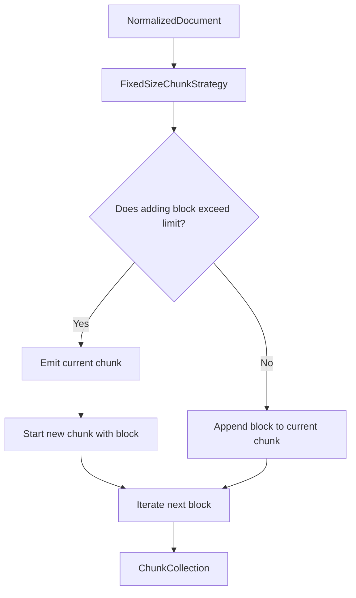

# Fixed-Size Chunking Strategy

## Overview
The `FixedSizeChunkStrategy` is a strictly deterministic chunking mechanism that bundles blocks together up to a predefined character limit (`max_characters`). It implements the canonical `AbstractChunkStrategy` contract, ensuring downstream compatibility with the rest of Kogniq's AI ecosystem.

## Purpose
While Structural Chunking preserves semantic intent by grouping under headings, it struggles with extremely long unstructured documents that lack headings. Fixed-Size Chunking acts as a reliable fallback, guaranteeing that context lengths sent to embedding models remain bounded.

## Algorithm & Constraints
1. **Block Atomicity**: Unlike naive character splitters, this strategy will *never* fracture a `NormalizedBlock`. If a single block intrinsically exceeds `max_characters`, it is emitted whole as an oversized chunk. This prevents words or code blocks from being broken mid-sentence.
2. **Reading Order**: Traversal sequentially processes pages and nested children precisely as the processor yielded them.
3. **Headings**: `HEADING` blocks dynamically update the `section_title` metric for chunks. The heading text is also embedded directly in the chunk text to preserve semantic context.

## Advantages
- Prevents infinite-length chunks.
- Highly deterministic and predictable behavior.
- Retains some structural context by including `HEADING` blocks in the emitted text flow.

## Limitations
- Blind to semantic meaning: may isolate the final concluding sentence of a paragraph into a separate chunk simply because the limit was reached.
- Headings can be orphaned from the paragraphs they describe if a split occurs exactly after a heading block.

## Relationship with Hybrid Chunking (Future)
Future strategies will weave the `StructuralChunkStrategy` and `FixedSizeChunkStrategy` together. A `HybridChunkStrategy` would use structural boundaries for clean separation, but fall back to a fixed-size or sliding-window approach when encountering an oversized semantic chunk.
