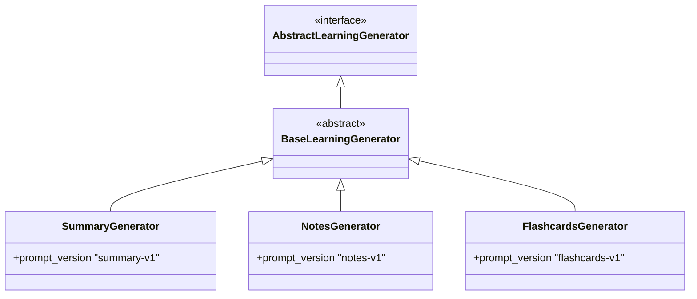
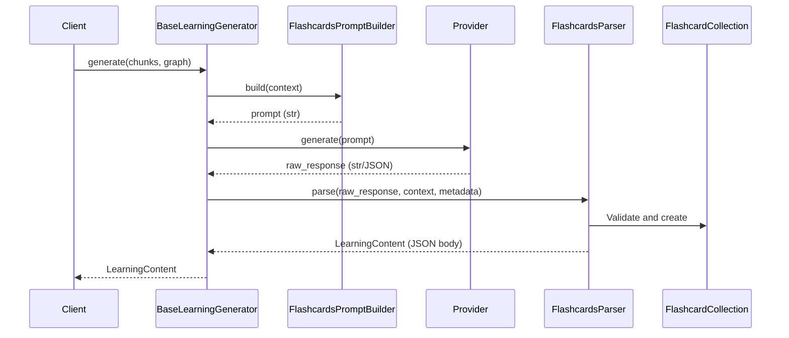

# Flashcards Generator Architecture

The Flashcards Generator is the third concrete implementation of the `BaseLearningGenerator` orchestration framework, and the first to generate **structured JSON artifacts** rather than free-form Markdown.

It validates that the Base framework correctly supports rigorous JSON parsing, domain model validation, and structured output logic, all without introducing provider-specific orchestration logic.

## Separation of Concerns

The `FlashcardsGenerator` packages exactly two components:

1. **`FlashcardsPromptBuilder`**: Constructs deterministic prompts explicitly commanding the LLM to output a raw JSON array of question, answer, and difficulty fields.
2. **`FlashcardsParser`**:
   - Parses the JSON output and aggressively validates it against the schema.
   - Triggers domain validation through the `Flashcard` model (checking for empty fields, duplicated questions, etc.).
   - Serializes the valid `FlashcardCollection` into a canonical JSON string to populate the `body` of the resulting `LearningContent`.

## Inheritance Hierarchy

## Data Flow

By storing the serialized `FlashcardCollection` string inside `LearningContent.body`, we avoid polluting the core domain boundary with generator-specific fields, allowing the artifact format to remain generic until a proper `LearningArtifact` abstraction is introduced.
