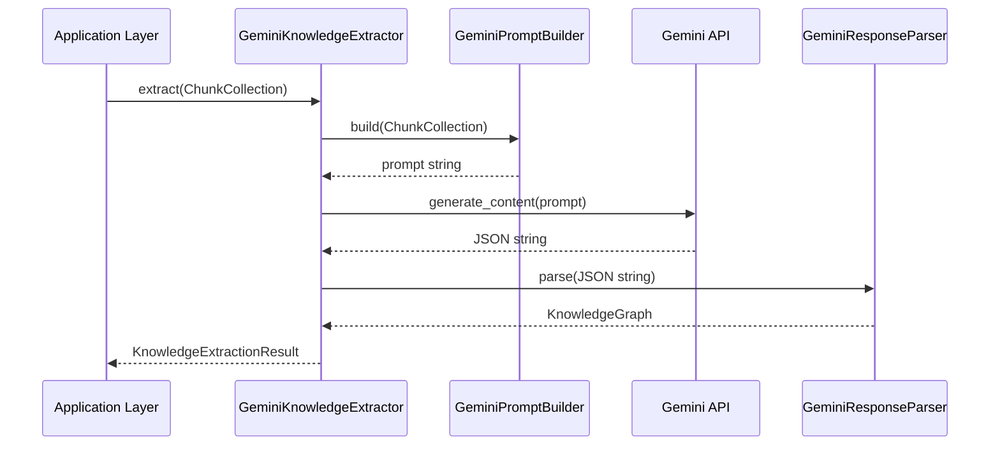

# Gemini Knowledge Extractor

**Last Updated:** 2026-07-14
**Status:** Implemented

## Context

The `GeminiKnowledgeExtractor` is the first concrete implementation of the `AbstractKnowledgeExtractor` interface. It leverages Google's Gemini SDK (`google-genai`) to parse text and extract structured `KnowledgeGraph` entities.

## Provider Isolation

To maintain our Clean Architecture, the Gemini SDK is strictly encapsulated inside `packages/knowledge/src/knowledge/extractors/gemini/`. 

Absolutely **no** SDK classes, clients, or proprietary Gemini response objects are ever returned to the caller. Instead, the boundary takes in a standard `ChunkCollection` and returns an immutable `KnowledgeExtractionResult` containing a purely semantic `KnowledgeGraph`. 

This guarantees that we can swap Gemini for OpenAI, Claude, or a local Llama instance dynamically without rewriting a single line of consuming application code.

## Component Breakdown

1. **Extractor**: Lazily initializes the Gemini client and orchestrates the extraction flow.
2. **Prompt Builder**: Translates the `ChunkCollection` into a deterministic, schema-enforced prompt demanding strictly valid JSON.
3. **Parser**: Defensively parses the JSON response, strips markdown blocks, handles malformed fields, deduplicates concepts, and instantiates the immutable graph elements.

## Flow

