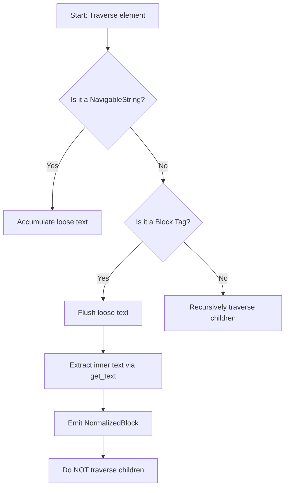

# HTML Processor Architecture

## Overview
The HTML Processor is a dedicated plugin in the Kogniq Content pipeline that extracts structural, educational content from static HTML files. It implements the standard `AbstractContentProcessor` interface and converts raw HTML into the canonical `NormalizedDocument` format.

## Parser Architecture
The processor leverages `beautifulsoup4` for static DOM traversal. It does not execute JavaScript or render CSS.

### Pre-Order Traversal Strategy
To preserve the natural reading order of the document, the processor uses a deterministic recursive pre-order traversal starting from the `<body>` element.
Instead of naively walking all nodes and duplicating text, the traversal selectively intercepts known block-level elements:

## Tag Mapping

### Supported Tags
| HTML Tag | NormalizedBlock Type | Notes |
| :--- | :--- | :--- |
| `h1` - `h6` | `HEADING` | Extracted sequentially. First heading might be used for title fallback. |
| `p` | `PARAGRAPH` | Flushes any accumulated loose text before extracting. |
| `li` | `LIST` | Represented as flat `LIST` blocks, inheriting structural conventions from Markdown. |
| `table` | `TABLE` | Preserves standard row/column structure, serialized into Markdown-like table syntax. |
| `pre` / `code` | `CODE` | Preserves internal newlines and spacing. |
| `blockquote` | `QUOTE` | Extracted entirely into a single block. |

### Ignored Elements
The following tags are immediately decomposed from the DOM before traversal begins, preventing them from introducing navigational noise or adversarial scripts:
`script`, `style`, `noscript`, `svg`, `canvas`, `iframe`, `video`, `audio`, `form`, `input`, `button`, `footer`, `nav`, `aside`.

## Title Fallback Strategy
Because HTML documents frequently omit structural titles, the processor attempts extraction in the following order:
1. `<title>` element inside `<head>`.
2. First `<h1>` element in the `<body>`.
3. First heading element (`<h2>` - `<h6>`) in the `<body>`.
4. The provided `ResourceHandle.filename`.

## Limitations
- **No JavaScript**: The parser operates on static markup. Dynamically rendered content (e.g., Client-Side Rendered React/Vue apps) will appear empty unless pre-rendered or Server-Side Rendered (SSR).
- **No Style Application**: CSS properties like `display: none` are ignored. Hidden elements are still parsed if they fall under supported block tags.
- **Complex Tables**: Deeply nested tables or tables with highly complex `rowspan`/`colspan` attributes may exhibit degraded serialization formats in the Markdown representation.
