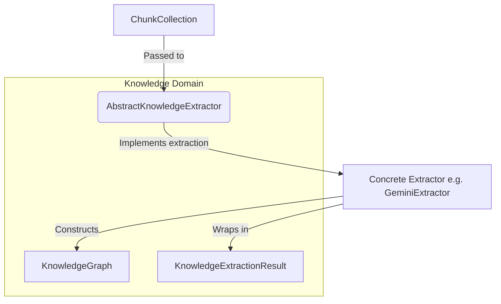

# Knowledge Extractor Interfaces & Registry

**Last Updated:** 2026-07-14
**Status:** Implemented

## Context

The `kogniq-knowledge` package establishes the immutable models for knowledge representation (`KnowledgeConcept`, `KnowledgeRelationship`, `KnowledgeGraph`).

To build these graphs from text, we need an extraction mechanism. Because the extraction logic is heavily dependent on specific AI providers (Gemini, OpenAI, Llama) and prompt engineering, it is strictly decoupled from the domain models.

The Knowledge Extractor Interfaces provide the canonical, dependency-inverted contract between the structural content domain (`ChunkCollection`) and the semantic knowledge domain (`KnowledgeGraph`).

## Dependency Inversion & Provider Independence

Instead of the Knowledge Graph domain importing `google-generativeai` or `openai` to build its models, it exposes an `AbstractKnowledgeExtractor` interface. External provider-specific packages (or application-level logic) will implement this interface.

This means:
1. The domain models never change when the LLM provider changes.
2. We can easily unit test the system using Fake extractors.
3. We can swap out an expensive cloud LLM for a local LLM dynamically through the `KnowledgeExtractorRegistry`.

## Abstraction Flow

## The Role of KnowledgeExtractionResult

When extraction completes, the raw `KnowledgeGraph` is wrapped in a `KnowledgeExtractionResult`. This serves as an immutable receipt, capturing the context of the extraction (processing time, tokens used, provider used) without polluting the `KnowledgeGraph` itself. This ensures the graph can be merged or manipulated independently of how it was originally extracted.
