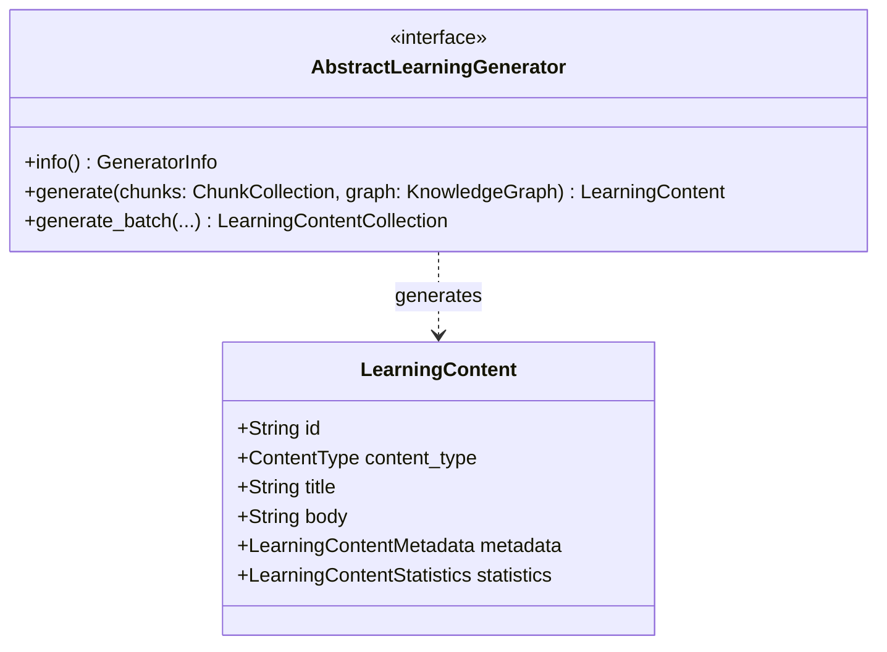

# Learning Content Generation Domain Architecture

## Overview

The Learning Content Generation bounded context (`kogniq-learning-content`) establishes the canonical, provider-agnostic domain for generating educational content. It is the first consumer of the complete Document Intelligence Pipeline and Knowledge Graph. 

The explicit goal of this bounded context is to define **immutable models, validation boundaries, and provider abstractions**.

### Crucial Architectural Constraint
This package represents **only** the educational content domain. It must **not** contain:
- Prompt engineering
- LLM SDK logic (e.g., OpenAI, Gemini, Anthropic)
- HTTP workflows
- Generation execution details or prompts

Those responsibilities belong to future concrete generators implementing the provider abstraction established here.

## Core Domain Models

All models strictly adhere to Kogniq's immutability standards using frozen dataclasses and the `ImmutableModel` base class.

- **`LearningContent`**: The unified output format representing generated educational artifacts. Requires non-empty body, title, and valid chunk linkages.
- **`LearningContentMetadata`**: Immutable metadata tracking the lineage of generation, including forward-compatible fields like `prompt_version`, `template_version`, and `generation_id` for when prompt engineering is introduced.
- **`LearningContentStatistics`**: Tracking token usage, processing time, and output word count, with rigid validation (e.g. confidence ∈ [0,1]).
- **`LearningContentCollection`**: An aggregate tuple wrapper for bulk generation outputs.
- **`ContentType`**: Enum representing discrete educational modalities (e.g. `SUMMARY`, `NOTES`, `FLASHCARDS`, `QUIZ`).

## Provider Abstractions

To isolate the domain from specific AI providers, we define:

- **`GeneratorInfo`**: Static metadata about what a concrete generator can do (supported content types, chunk limits, generator version).
- **`AbstractLearningGenerator`**: The interface that concrete implementations (e.g., a Gemini Flashcard generator) must satisfy. It strictly consumes `ChunkCollection` and `KnowledgeGraph` and strictly outputs `LearningContent`.

## Registry Pattern

Similar to extractors and vector stores, learning generators are dynamically registered via the `LearningGeneratorRegistry`, providing O(1) duplicate-safe lookups by generator ID.

## Relationship to the Pipeline

The Learning Content domain consumes the outputs of the Document Intelligence Pipeline. It receives the `ChunkCollection` produced by the chunking engine and the `KnowledgeGraph` synthesized by the knowledge extractors, transforming these rich, bounded context outputs into final educational modalities.
