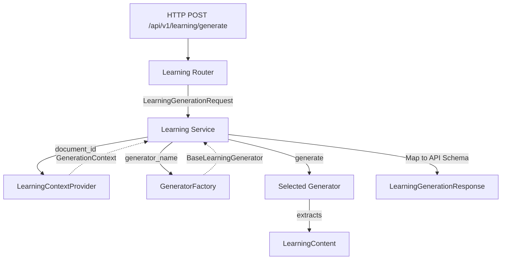

# Learning Generation API

The Kogniq Learning Generation API exposes the decoupled `BaseLearningGenerator` framework to external clients through HTTP.

## Request Flow

## Architectural Highlights

- **Complete Decoupling**: The API endpoint itself is fully agnostic to what is being generated, how the prompt is formed, or which LLM is processing it. It merely orchestrates domain boundaries.
- **LearningContextProvider**: This component loads the `ChunkCollection` and `KnowledgeGraph` for a specific `document_id`. The HTTP layer never handles raw chunks.
- **GeneratorFactory**: Acts as the dependency injection root for generators. Resolves and returns the fully loaded `SummaryGenerator`, `NotesGenerator`, or composite `StudyGuideGenerator`.
- **Response Safety**: The API response deliberately strips out the raw `prompt_versions`, embeddings, or the raw context graph used to generate the payload, instead returning safe metadata and statistics about the payload.
