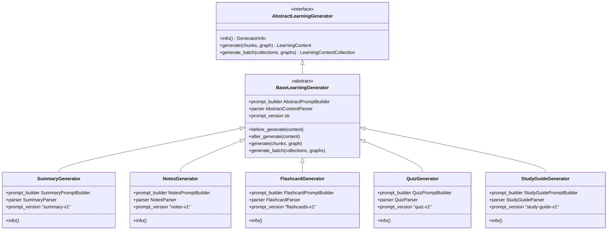
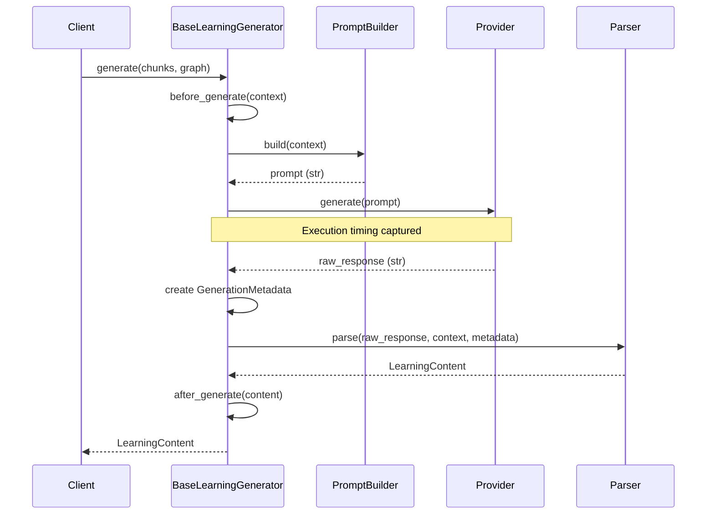

# Learning Generation Framework

The Learning Generation Framework provides a robust, reusable orchestration layer for generating AI pedagogical artifacts (Summaries, Notes, Flashcards, Quizzes, Study Guides). By centralizing orchestration, it eliminates duplication and strictly enforces separation of concerns across all generation tasks.

## Architectural Separation of Concerns

Generation is split into four distinct, immutable responsibilities:

1. **Generator (`BaseLearningGenerator`)**: Owns the orchestration. It invokes the Prompt Builder, calls the Provider, handles timing, handles failures, and executes the Parser. It does not contain any artifact-specific logic.
2. **Prompt Builder (`AbstractPromptBuilder`)**: Owns deterministic prompt construction. It receives a `GenerationContext` (Chunks and Knowledge Graph) and formats it.
3. **Provider (`AbstractTextGenerationProvider`)**: Owns stateless LLM communication. It only knows about strings and tokens. It does not know about learning content.
4. **Parser (`AbstractContentParser`)**: Owns parsing and validating the raw LLM string into a structured `LearningContent` entity. It receives `GenerationMetadata` but never interacts directly with the provider.

## Inheritance Hierarchy

All future pedagogical generators in Kogniq inherit from this unified base structure.

## Data Flow Orchestration

The `BaseLearningGenerator` strictly manages the flow of data using immutable context models.

By adhering to this framework, we ensure that adding a new generation feature requires *only* a new prompt string builder and a new parser. The overarching architecture handles the rest.
