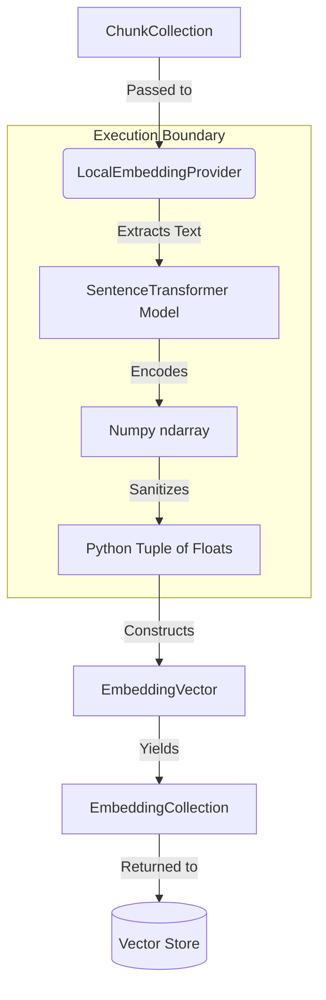

# Local Embedding Provider Architecture

## Overview
The `LocalEmbeddingProvider` serves as Kogniq's reference implementation for the `AbstractEmbeddingProvider` interface. It implements on-device generation using `sentence-transformers`, strictly separating machine-learning execution from the pure mathematical domain of embeddings.

## Data Flow Pipeline

## Architectural Tenets
1. **Zero Framework Leakage**: At no point does a `torch.Tensor` or `numpy.ndarray` cross the provider boundary. The orchestrator receives standard, immutable `tuple[float, ...]` structures inside domain models.
2. **Lazy Loading**: Constructing the `LocalEmbeddingProvider` does not instantiate the underlying neural network. The `SentenceTransformer` model is only loaded into memory when `generate`, `generate_batch`, or `info` is explicitly invoked, preventing heavy memory consumption during startup or in tests that do not exercise the generation pipeline.
3. **Dynamic Introspection**: Metadata, specifically vector dimensions, is introspected at runtime using `.get_sentence_embedding_dimension()`. This ensures absolute correctness in `ProviderInfo` validation logic.
