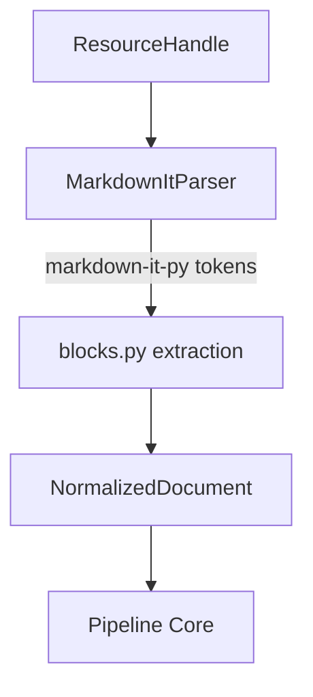

# Markdown Processor Architecture

The Markdown processor (`packages/content/src/content/processors/markdown`) is responsible for linearly extracting semantic content from Markdown documents and normalizing them into `NormalizedDocument` representations. 

It is the second concrete implementation of the `AbstractContentProcessor` adhering to the standard content pipeline boundary.

## Pipeline Architecture



## Supported Syntax

The processor natively parses and normalizes the following Markdown structures:
- **Headings**: `#` through `######` mapped to `BlockType.HEADING`.
- **Paragraphs**: Standard text paragraphs mapped to `BlockType.PARAGRAPH`.
- **Lists**: Ordered and unordered lists mapped to `BlockType.LIST`.
- **Block Quotes**: Mapped to `BlockType.QUOTE`.
- **Fenced Code**: Mapped to `BlockType.CODE` including language info if present.
- **Horizontal Rules**: Mapped to `BlockType.UNKNOWN` or skipped cleanly.
- **Tables**: Recognized standard table syntax mapped to `BlockType.TABLE`.

## Limitations

- HTML elements embedded in the markdown file are parsed as literal inline text blocks by default. No HTML parsing engine is active in this plugin.
- Diagrams like Mermaid and Math rendering are deferred to future stages and will remain mapped as standard code/text blocks for now.

## Future HTML Support

In future milestones, an HTML Processor will be added. At that time, we may integrate it tightly with the Markdown pipeline to extract complex web embeds explicitly via AST traversal.

## Developer Verification

A standalone developer utility `dev/demo_markdown_processor.py` is available for verifying the processor against local Markdown files.

Usage:
```bash
uv run python dev/demo_markdown_processor.py [path_to_md]
```
By default, it looks for `dev/sample_documents/sample.md`.
