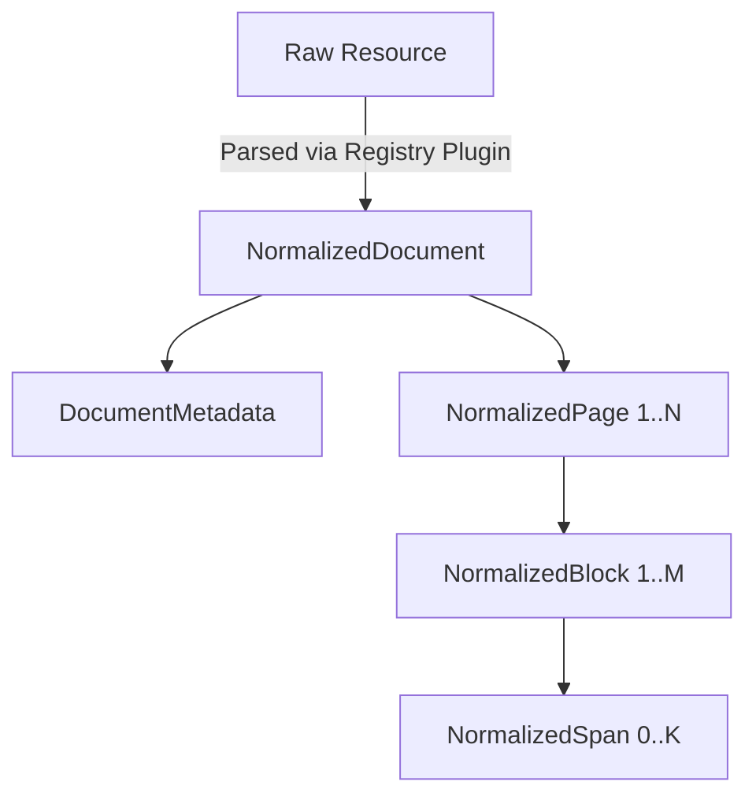

# Normalized Document Architecture

## Purpose
The Normalized Document Model serves as the single canonical data structure for all content processed within Kogniq. Kogniq will eventually support PDFs, DOCX, Markdown, HTML, plain text, and YouTube transcripts. Without a unified representation, downstream components (chunkers, embedders, knowledge graph extractors) would need `N` implementations for `N` resource types.

Normalization enforces an $O(1)$ scaling factor for downstream components:
- `N` Parsers convert arbitrary inputs $\rightarrow$ 1 Normalized Model
- 1 Normalized Model $\rightarrow$ `M` Downstream Consumers

## Entity Diagram
- `NormalizedDocument`: The root aggregate containing metadata and sequence of pages.
- `NormalizedPage`: Contains dimensions and a sequence of layout blocks.
- `NormalizedBlock`: A specific semantic unit (Heading, Paragraph, Table, Code) maintaining bounding box coordinates and reading order.
- `NormalizedSpan`: Represents granular inline styling (bold, italic, hyperlinks) within text blocks.

## Architecture

## Future Parser Flow
1. A raw `LearningResource` enters the `ContentProcessingPipeline`.
2. The `ProcessorRegistry` selects the correct `AbstractContentProcessor` (e.g., `PDFProcessor`).
3. The processor parses the binary stream, extracting structure, text, and metadata.
4. The processor returns a strictly typed `NormalizedDocument` ensuring all invariants (e.g., non-empty titles, positive page numbers, block reading orders) are satisfied prior to downstream AI ingestion.
