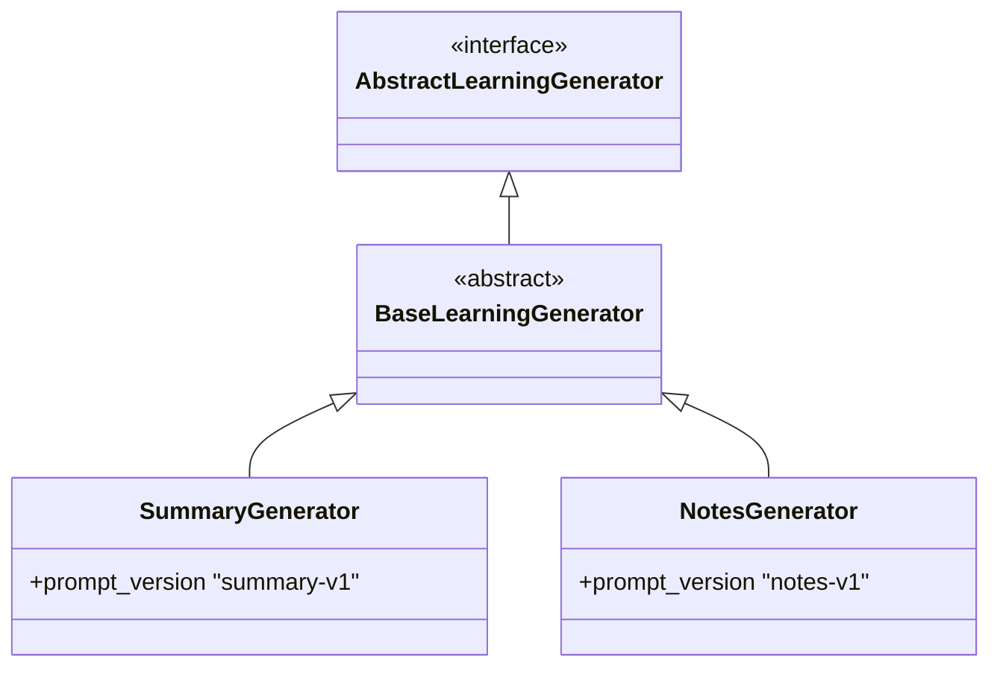
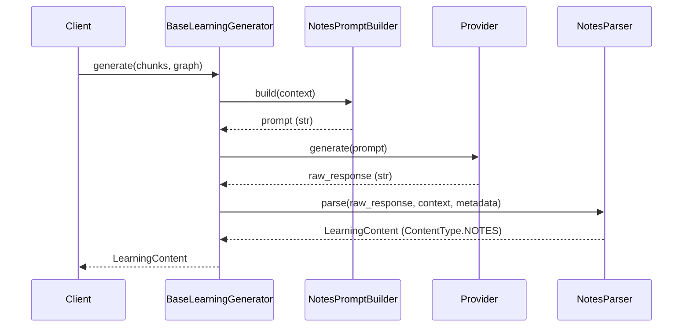

# Notes Generator Architecture

The Notes Generator is the second concrete implementation of the `BaseLearningGenerator` orchestration framework. It validates that the framework can successfully generate multiple distinct pedagogical artifact types without any duplication of orchestration, timing, metadata, or provider logic.

## Separation of Concerns

The `NotesGenerator` packages exactly two components:

1. **`NotesPromptBuilder`**: Deterministically constructs prompts explicitly commanding the LLM to synthesize chunks and knowledge graphs into structured Markdown notes (Headings, Bullet points, Exam Tips, etc.).
2. **`NotesParser`**: Strict parsing logic that validates output, strips placeholder text, protects markdown structure (whitespace is selectively trimmed to avoid breaking code blocks and nested lists), and returns a verified `LearningContent` object of type `NOTES`.

## Inheritance Hierarchy

## Data Flow

By relying completely on `BaseLearningGenerator`, `NotesGenerator` remains strictly decoupled from the actual LLM vendor (e.g. OpenRouter) and ensures identical lifecycle timing and metadata capabilities as the Summary generator.
