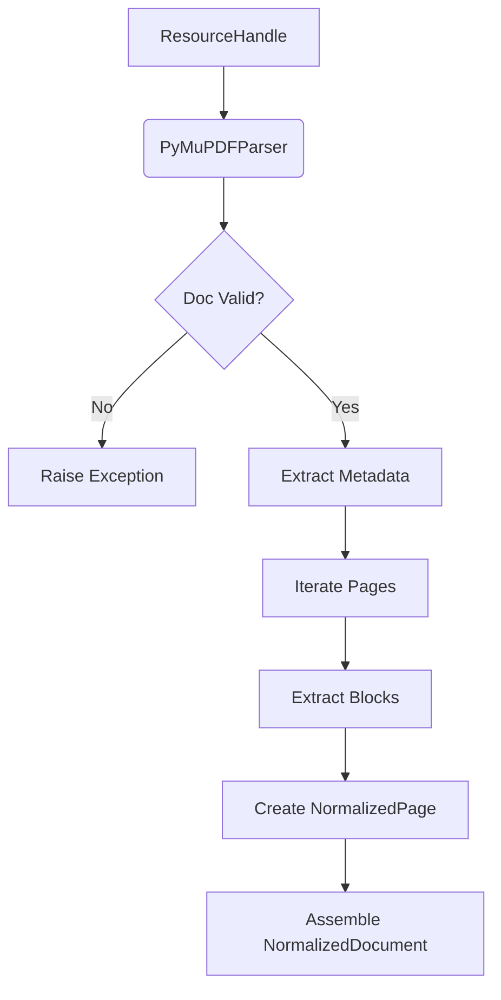

# PDF Processor Architecture

The PDF processor is the first concrete implementation of the `AbstractContentProcessor` in the Kogniq Content pipeline. It consumes a `ResourceHandle` and produces a `NormalizedDocument`.

## Processing Pipeline



## PyMuPDF Choice

We use PyMuPDF (`fitz`) for the PDF processor foundation because:
- It is exceptionally fast compared to pure Python alternatives (e.g. `pypdf2`).
- It extracts complex layouts, including semantic bounding boxes and block grouping.
- It operates smoothly with byte streams in memory, cleanly separating infrastructure concerns from processing concerns.
- It does not leak heavy AI dependencies (LangChain, LlamaIndex, Unstructured).

## Future Capabilities

The foundation extracts text paragraphs successfully. Future expansions inside the PyMuPDF processor (or as plugin extensions) will address:
- **OCR**: Handling scanned PDFs by hooking PyMuPDF with Tesseract.
- **Images**: Extracting images as embedded assets.
- **Tables**: Utilizing table layout recognition logic.
- **Formulas**: Identifying mathematical syntax blocks.

## Developer Verification

A standalone developer utility `dev/demo_pdf_processor.py` is available for verifying the processor against local PDFs. 

Usage:
```bash
uv run python dev/demo_pdf_processor.py [path_to_pdf]
```
By default, it looks for `dev/sample_documents/transformer_paper.pdf`.
