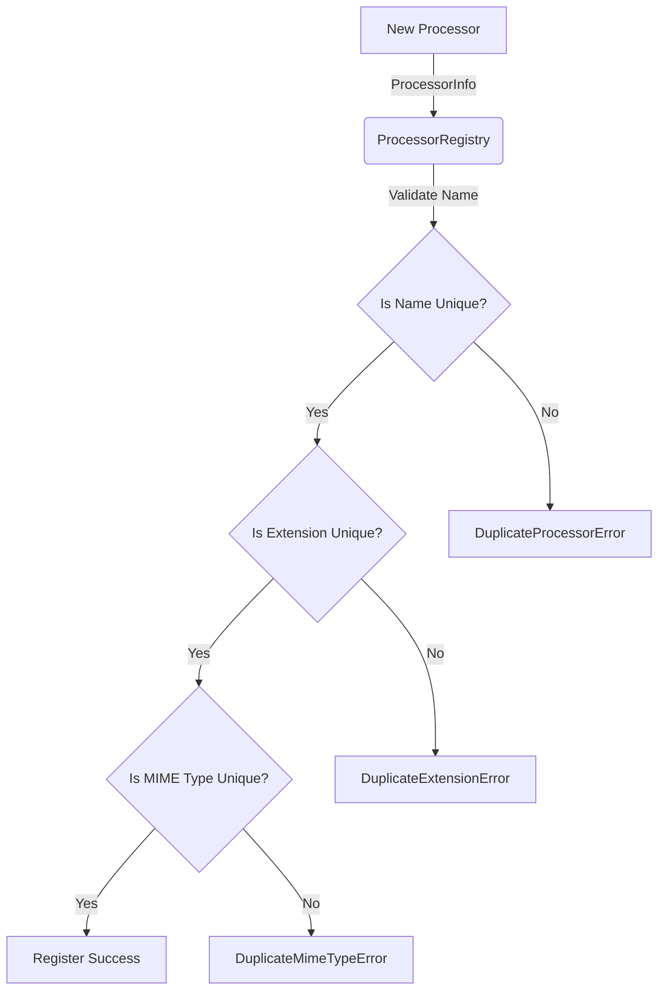

# Processor Registry Architecture

The `ProcessorRegistry` (`packages/content/src/content/plugins/registry.py`) is the canonical discovery mechanism for all content processors in Kogniq.

## Architecture

The registry provides O(1) deterministic discovery of processors using purely immutable capability models (`ProcessorInfo`).

## Discovery

Once registered, pipelines use `processor_for_resource(ResourceHandle)` to locate the appropriate processor. The registry normalizes inputs case-insensitively and returns the processor, maintaining strict bounds on immutability by returning native Python tuples for collections.

## Future Plugin Architecture
Because the registry operates dynamically against the `AbstractContentProcessor` protocol and derives all metadata from `ProcessorInfo`, future developers can inject third-party or proprietary plugins by simply calling `registry.register(MyCustomProcessor())`. The core system requires no modifications to discover and orchestrate new types.
