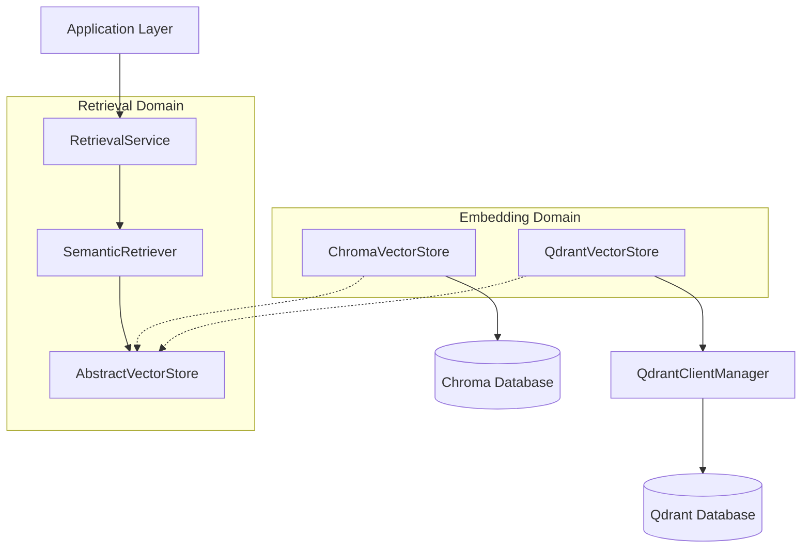

# Qdrant Vector Store Architecture

Kogniq supports integrating with multiple vector databases dynamically through its `AbstractVectorStore` interface. Qdrant is the recommended vector database for production use, while ChromaDB remains available for local testing and development.

## Abstraction Layers

The retrieval domain relies entirely on abstractions, keeping the business logic independent of any specific vector database SDK.



## Factory Instantiation

The composition root (`backend/dependencies.py` -> `RetrievalFactory`) controls which concrete database is injected into the `SemanticRetriever`.

Configuration is driven by `VECTOR_STORE_PROVIDER` in the application environment variables.

```python
if settings.vector_store_provider == "qdrant":
    manager = QdrantClientManager(url=settings.qdrant_url)
    vector_store = QdrantVectorStore(
        manager=manager, 
        collection_name=settings.qdrant_collection
    )
elif settings.vector_store_provider == "chroma":
    vector_store = ChromaVectorStore(...)
```

## Qdrant Specifics

The `QdrantClientManager` provides robust lifecycle operations:
1. **Idempotent initialization**: Ensures collections exist based on dynamic embedding dimensions without inadvertently truncating data on restart.
2. **Health Checks**: Provides lightweight ping operations to verify connection health for the main application API.
3. **Graceful Shutdown**: Properly cleans up client resources.

The `QdrantVectorStore` maps Kogniq `Embedding` Domain Models to Qdrant `PointStruct`s, managing automatic metadata extraction, stable ID hashing (via UUIDv5 since Qdrant requires valid UUIDs), and transparent search parsing.
