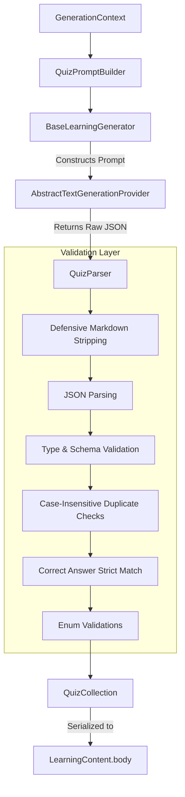

# Quiz Generator Architecture

The `QuizGenerator` is the fourth concrete learning generator for Kogniq, extending the structured JSON generation pattern established by the Flashcards generator. It natively produces deeply-validated, highly-structured multiple-choice questions (MCQs) while relying entirely on the `BaseLearningGenerator` for its orchestration.

## Architecture

## Features

1. **Immutable Options Model**: We utilize a `QuizOption` immutable object with UUIDs (or labels like A, B, C, D) to gracefully permit UI randomization later without losing answer correlation.
2. **Strict Validation**: The parser is highly defensive: checking exact bounds (4 unique options), non-empty fields, domain consistency (explanation != answer), and deduplication across questions.
3. **No Generator Logic Expansion**: Like previous generators, `LearningContent` handles all cross-cutting concerns (statistics, contexts, token budgets), proving the original `BaseLearningGenerator` framework is genuinely extensible.
