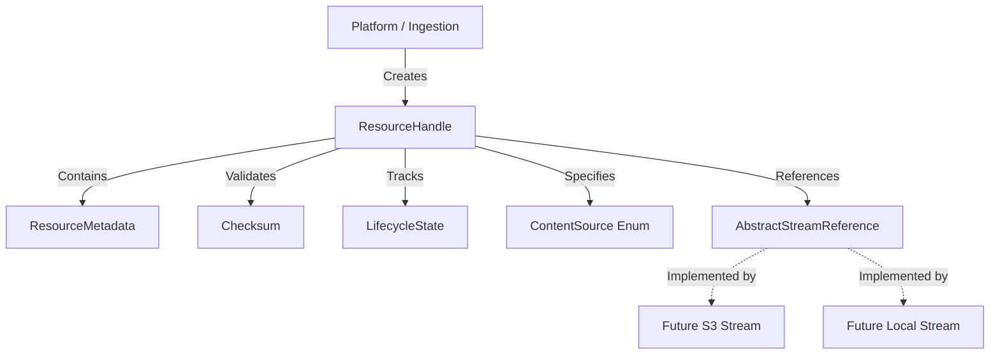
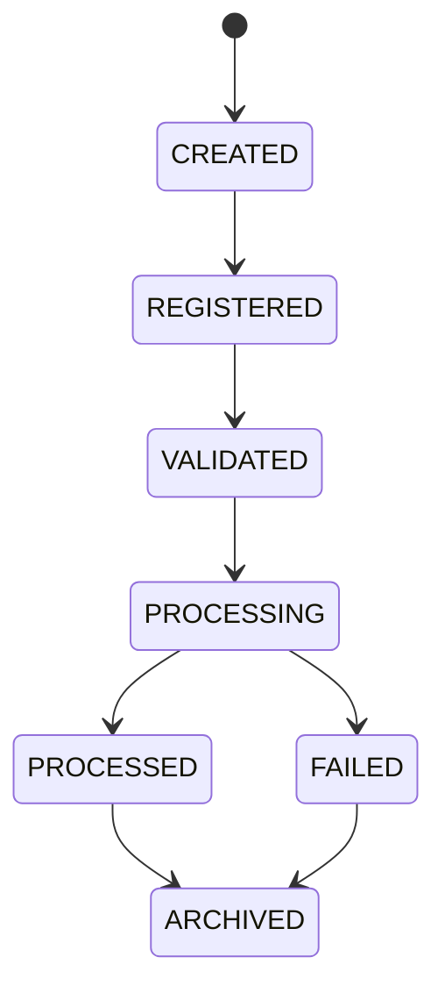

# Resource Handle Architecture

## Purpose
The `ResourceHandle` provides a unified, immutable reference to any learning material processed within Kogniq, regardless of where that content is physically stored (e.g. Local disk, S3, MinIO, remote URL, or generated in-memory).

Content parsers (such as PDF, Markdown, or YouTube processors) must **never** operate directly on local filenames or arbitrary paths. This enforces isolation between the content processing logic and the infrastructure used to store the binary streams.

## Architecture

## Lifecycle States
Learning resources progress through a deterministic set of states during ingestion and processing.

## Future Storage Integration
The `AbstractStreamReference` acts as a pure interface. When Kogniq integrates with a storage provider (like MinIO or S3) in a future stage, that provider will implement `AbstractStreamReference` to supply `open()` or `read()` semantics. Content parsers will request the stream directly from the handle, completely agnostic to whether the bits originate from a local disk or an object storage bucket.
