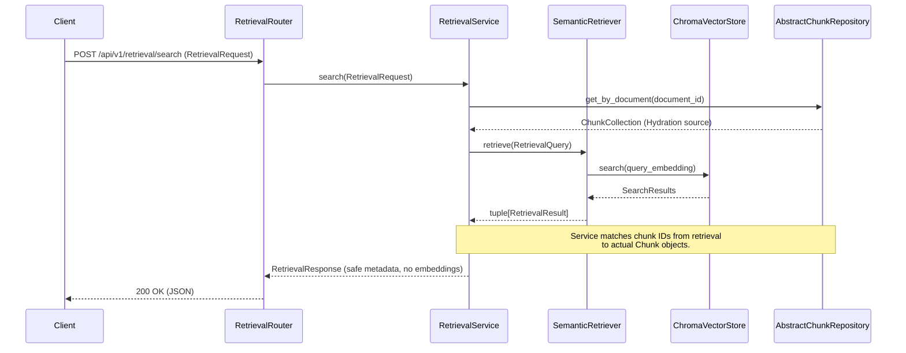

# Retrieval API Architecture

The Kogniq Retrieval API exposes the underlying semantic search domain via a clean HTTP layer, strictly adhering to Dependency Inversion.

## Separation of Concerns

The fundamental architectural principle here is that the `RetrievalService` has no knowledge of semantic logic, embeddings, or Vector Store abstractions. It simply orchestrates the flow of data.

## Safety and Portability

1. **Hydration via Repository**: Semantic stores rarely guarantee absolute data integrity for text. The source of truth for text remains the `AbstractChunkRepository`.
2. **Abstract Boundaries**: `RetrievalFactory` supplies the concrete `LocalEmbeddingProvider` and `ChromaVectorStore` hidden behind `AbstractRetriever`.
3. **No Database Leakage**: Embeddings, vector distances, and internal database paths are never leaked into the `RetrievalResponse`.
