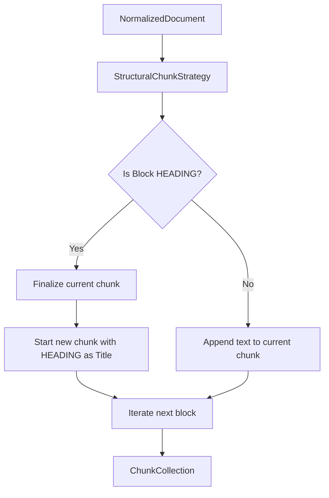

# Structural Chunking Strategy

## Overview
The Structural Chunking Strategy is the primary and baseline mechanism for partitioning `NormalizedDocument` instances into canonical `ChunkCollection` representations in Kogniq. It leverages the semantic structure provided by processors (such as Markdown or DOCX) to define semantic boundaries around `HEADING` blocks.

## Why Structural Chunking?
Structural chunking respects the author's original layout intent. Rather than arbitrarily splitting a paragraph midway through because a fixed token limit was reached, structural chunking maintains the cohesion of the topics as defined by the author's own section headers.

## Advantages
- **Preserves Intent**: Ensures paragraphs, tables, and lists stay contextually grouped with their parent headings.
- **Deterministic**: Execution is highly predictable and does not rely on opaque LLM tokenization logic or non-deterministic AI models.
- **Computationally Free**: Requires no model calls and minimal string manipulation.

## Limitations
- **Oversized Chunks**: If a document has no headings but 50 pages of text, the entire document becomes a single massive "Introduction" chunk, which may exceed embedding model context windows.
- **Undersized Chunks**: Consecutive headings without paragraph bodies generate tiny chunks which may lack retrieval context.
- **Flat Hierarchy**: H1 through H6 are treated identically. Nested relationships are not captured.

## Future Interactions
The `StructuralChunkStrategy` fulfills the `AbstractChunkStrategy` interface. Future strategies such as:
1. **Fixed-Size Chunking** (sliding window algorithms)
2. **Semantic Chunking** (similarity-based boundary detection)
3. **Hybrid Chunking** (structural first, then fixed-size for oversized chunks)

can easily be introduced to mitigate structural limitations while adhering to the same interface contract.
