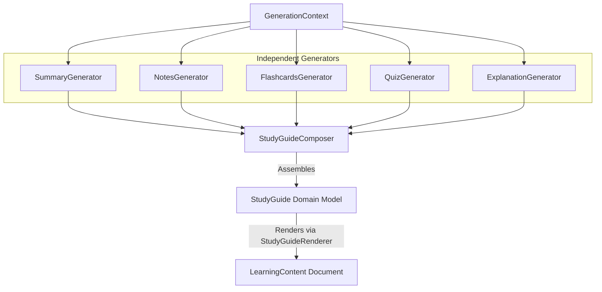

# Study Guide Generator Architecture

The `StudyGuideGenerator` represents Kogniq's first orchestration-oriented educational generator—a **composition engine**, not an AI prompt. Instead of generating new content directly via an LLM, it systematically sequences our existing, specialized generators and synthesizes their structurally verified output into a unified artifact.

## Architecture

## Features

1. **True Reusability**: The prompt logic, markdown preservation, schema validation, and JSON defenses we've baked into the underlying 5 generators remain completely localized and isolated.
2. **Pluggable Composability**: Because the `StudyGuideComposer` only expects a sequence of `LearningContent`, extending the Study Guide in the future (e.g. adding MindMaps) requires exactly zero changes to the composer itself.
3. **Deterministic Rendering**: Our `StudyGuideRenderer` reliably and robustly strips the JSON from Flashcards/Quizzes back into a beautiful Markdown format, ensuring visual consistency regardless of execution order.
4. **Resilient Aggregation**: Metadata from every sub-generator is aggregated properly, ensuring prompt version trails (e.g. `flashcards-v1,notes-v1...`) are seamlessly preserved in the final output artifact.
