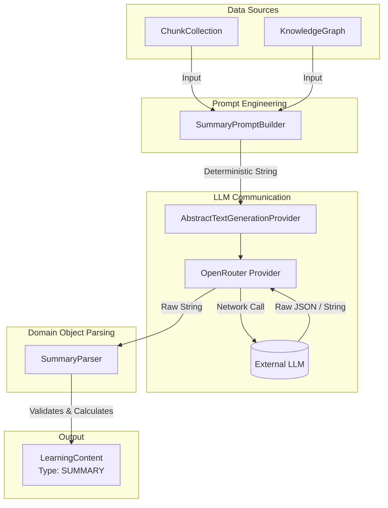

# Summary Generation Pipeline

**Bounded Context:** `packages/learning-content`

This document describes the architectural flow of the first end-to-end AI-powered learning pipeline in Kogniq. The architecture established here serves as the canonical reference for all future generators (e.g. Flashcards, Quizzes, Study Guides).

## Pipeline Architecture

The primary goal of the generation pipeline is to enforce strict boundaries between **Prompt Engineering**, **LLM Communication**, and **Domain Object Parsing**.

## Key Architectural Principles

1. **Prompt Engineering Separation**: `SummaryPromptBuilder` only knows how to turn a `ChunkCollection` and `KnowledgeGraph` into a single, highly deterministic string. It does not know how the generation will happen.
2. **LLM Communication Separation**: `AbstractTextGenerationProvider` receives a string and returns a string. It performs no business logic, does no prompt template injection, and has no understanding of what kind of educational content is being generated.
3. **Parser Independence**: `SummaryParser` converts raw strings into immutable domain models (`LearningContent`). It enforces structural requirements, rejects placeholders ("I cannot answer"), generates `LearningContentStatistics`, and constructs `LearningContentMetadata`.
4. **Generator as Orchestrator**: `SummaryGenerator` only orchestrates the above components. It never imports SDKs like `openai` directly.
