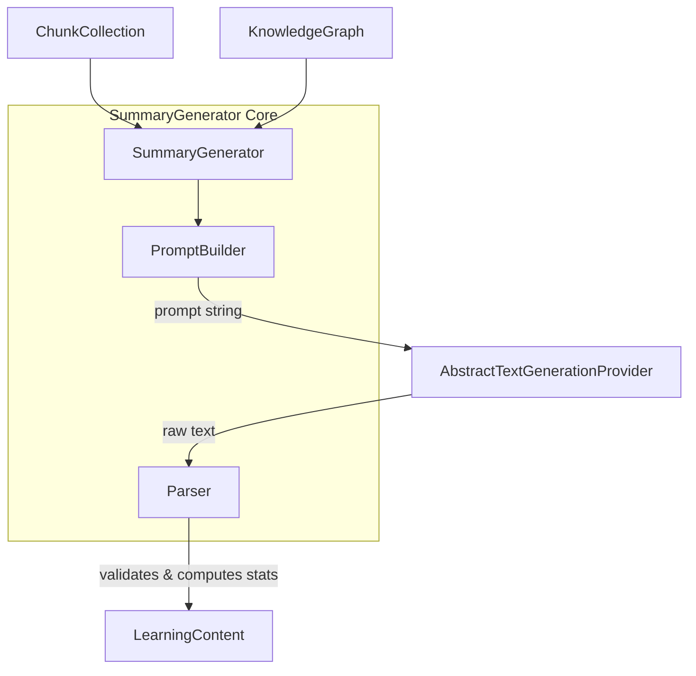

# Summary Generator Architecture

The `SummaryGenerator` is the first concrete implementation of the `AbstractLearningGenerator` interface in Kogniq's `Learning Content` bounded context.

More importantly, it serves as the **canonical reference architecture** that all future educational content generators must follow.

## Canonical Reference Architecture

All generators (e.g., `FlashcardGenerator`, `NotesGenerator`, `QuizGenerator`, `StudyGuideGenerator`) must separate concerns across three primary boundaries:

1. **Prompt Builder**: Deterministically constructs prompts from source `ChunkCollection`s and `KnowledgeGraph`s.
2. **Text Generation Provider**: A decoupled interface (`AbstractTextGenerationProvider`) representing the AI LLM integration.
3. **Parser**: Validates and normalizes the provider's text response into strongly-typed `LearningContent` objects.

## Dependency Inversion

By forcing `SummaryGenerator` to depend exclusively on `AbstractTextGenerationProvider`, Kogniq remains free from SDK lock-in (e.g., OpenAI, Google, Anthropic). No ML or HTTP logic exists within the generators themselves.

## The Generator Flow

1. **Orchestration**: The `SummaryGenerator` acts strictly as a coordinator.
2. **Prompting**: The `SummaryPromptBuilder` builds structured strings with distinct internal sections: `_build_objective`, `_build_concepts`, `_build_relationships`, and `_build_source_content`. This compartmentalization ensures reusability.
3. **Generation**: The string is handed to the provider.
4. **Parsing**: The `SummaryParser` ensures the response is non-empty, calculates heuristics (e.g., character count, estimated tokens), and assigns a neutral confidence placeholder (`0.5`) until full evaluation pipelines are introduced.
5. **Output**: The finalized `LearningContent` is yielded to the upstream pipeline.
