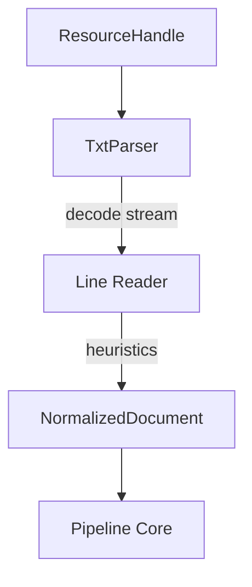

# TXT Processor Architecture

The TXT processor (`packages/content/src/content/processors/txt`) is responsible for linearly extracting semantic content from plain text (`.txt`) documents and normalizing them into `NormalizedDocument` representations.

It is the fourth concrete implementation of the `AbstractContentProcessor` adhering to the standard content pipeline boundary.

## Pipeline Architecture



## Supported Syntax

The processor natively parses and normalizes plain text by evaluating line properties:
- **Headings**: Mapped to `BlockType.HEADING` based on three heuristics (Markdown style `#`, Underline style `===`, or ALL CAPS).
- **Paragraphs**: Contiguous lines of non-blank text are grouped and mapped to `BlockType.PARAGRAPH`. Blank lines signify paragraph boundaries.

## Line Endings & Encoding
- Supports Unix `\n`, Windows `\r\n`, and Legacy `\r` endings transparently using universal newline boundaries.
- strictly enforces UTF-8 or UTF-8 BOM encoding. Invalid bytes result in a defined `TXTUnsupportedEncodingError`.

## Developer Verification

A standalone developer utility `dev/demo_txt_processor.py` is available for verifying the processor against local TXT files. It will dynamically generate a sample file if none is provided.

Usage:
```bash
uv run python dev/demo_txt_processor.py [path_to_txt]
```
By default, it looks for `dev/sample_documents/sample.txt`.
