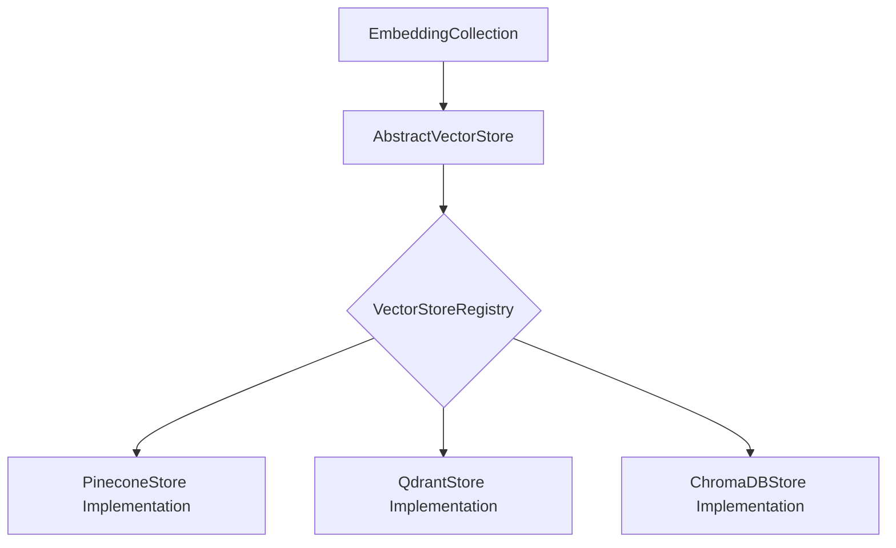

# Vector Store Architecture

Kogniq's vector database integration follows a strict Provider-Agnostic architecture. To ensure future adaptability, Kogniq does not directly bind to database SDKs like Qdrant, Pinecone, or ChromaDB in its core layer.

Instead, we use a central `AbstractVectorStore` interface and `VectorStoreRegistry`.

## Abstraction Flow

## Immutable Domain Models
- **SearchResult**: Retains pure provider independence by encapsulating the `Embedding` object and a universal `similarity_score` without leaking native result cursors.
- **StoreInfo**: Contains capabilities like `supported_distance_metrics` and limits (`maximum_batch_size`).

## Registry
The `VectorStoreRegistry` behaves exactly like our Content and Embedding registries. It implements `O(1)` immutable lookup, guarantees singleton registry semantics, and prevents ID duplication.
