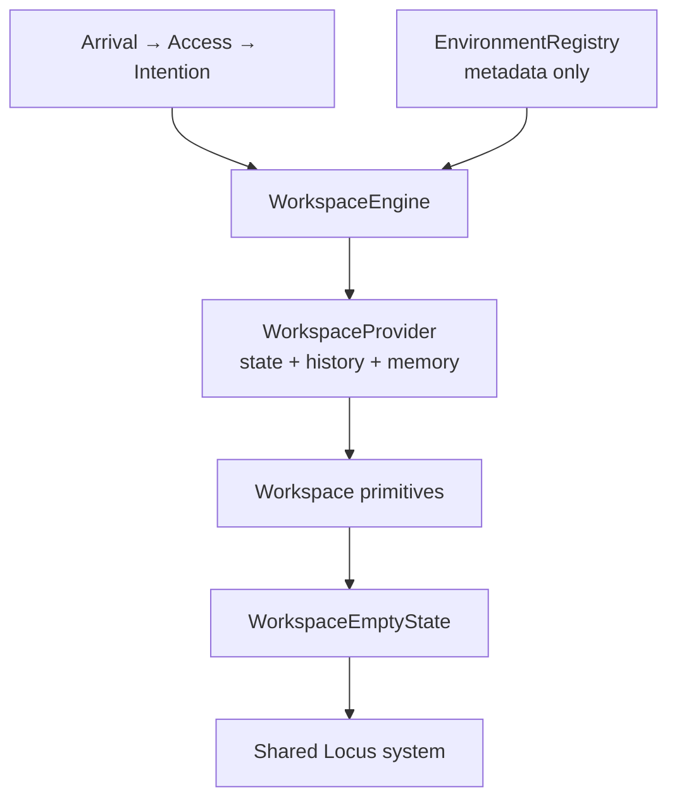
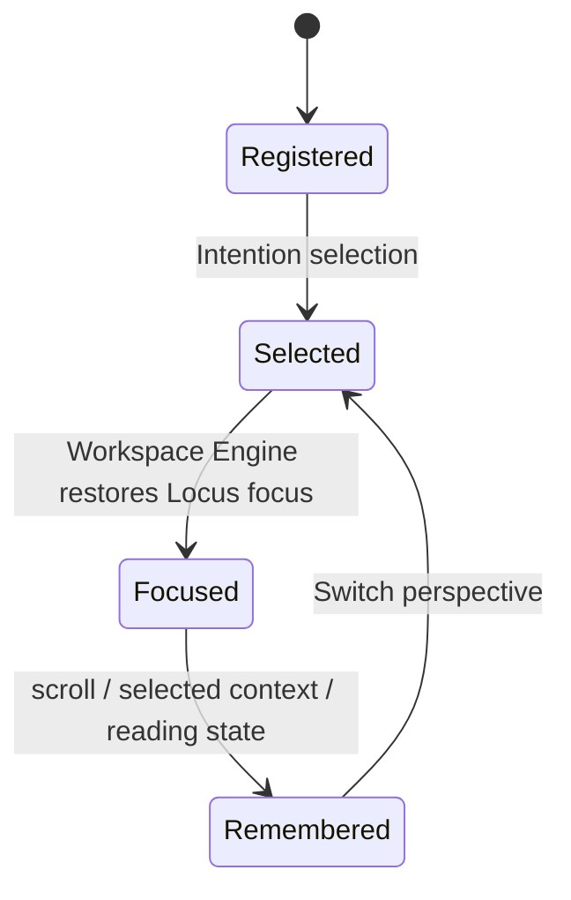
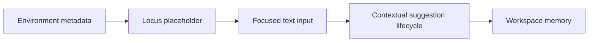

# Workspace Engine

## Purpose

The Workspace Engine is Kogniq's frontend execution environment. It keeps Documents, Knowledge Graph, Search, Studio, Study, Flashcards, Quiz, and Analytics inside one thinking environment without implementing any of those capabilities.

It owns frontend composition only: active environment, registered metadata, perspective history, workspace memory, focus restoration, reduced-motion timing, and the shared Locus starting point. It has no backend calls, document rendering, AI behavior, or business rules.

## Architecture



`WorkspaceEngine` composes `WorkspaceProvider`, `WorkspaceTransitionBoundary`, `WorkspaceSurface`, `WorkspaceHeader`, `WorkspaceContent`, `WorkspaceEmptyState`, and `WorkspaceFooter`. Future environments register metadata and compose inside this structure; they do not create an application shell.

## Environment lifecycle



An environment describes only its title, description, contextual Locus placeholder, motion profile, reading rhythm, and optional contextual panel names. The registry intentionally contains no rendering logic, API clients, or capability-specific state.

## Locus lifecycle



There is one Locus implementation in `apps/web/src/components/locus`. It owns the caret, semantic input, placeholder, suggestion lifecycle, and reduced-motion-compatible reveal. Environments supply language; they do not duplicate interaction behavior.

## Transition lifecycle

Arrival, Access, and Intention transform into Workspace through shared typography and layout. Inside Workspace, `WorkspaceTransitions` uses the central motion policy from `WorkspaceMotion`. Reduced motion resolves transitions immediately while retaining hierarchy and focus.

No page slides, fade-to-black states, loading spinners, skeleton screens, or capability-specific transition helpers belong here.

## State and accessibility

`WorkspaceProvider` preserves focus target, scroll position, selected context, opened document identifier, and reading position per environment. The engine restores the Locus after activation. Workspace controls use semantic HTML, visible focus styles, native text inputs, keyboard navigation, and responsive layouts that adapt without a separate mobile application.

## Extension contract

1. Add a metadata-only environment module under `apps/web/src/app/workspace/environments/`.
2. Register it through `EnvironmentRegistry`.
3. Use existing workspace and Locus primitives.
4. Keep capability UI, data fetching, and business behavior outside the engine.

## Verification

Run inside `apps/web`:

```powershell
npm run lint
npm run typecheck
npm run test
npm run build
```

The test suite covers metadata registration, provider lifecycle, environment switching, memory preservation, focus restoration, and reduced-motion transition timing.
